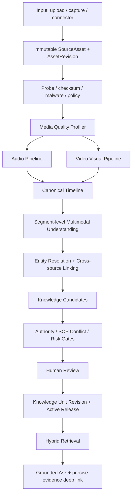

# Enclave 音訊與影片多模態知識處理工程架構暨實作計畫

> 文件狀態：Reviewed / Accepted for phased implementation
> 版本：v1.1
> 日期：2026-09-05
> 適用範圍：Enclave Core Input、Enterprise Knowledge Kernel、Ask、Review Workspace
> 不涵蓋：特定部門應用流程、特定機台故障診斷模型、取代企業正式 SOP
> 重要說明：本文中的「現況」來自 2026-09-05 程式碼與既有驗收文件；「目標」與「Gate」是後續工程規格，不代表目前正式環境已經具備或達標。
> 實作追蹤：軟體實作與 Code Review 結果記錄於 `AUDIO_VIDEO_MULTIMODAL_IMPLEMENTATION_AND_CODE_REVIEW_2026-09-05.md`；AV8 外部證據未完成前不得宣稱 Pilot Certified。

---

## 1. 決策摘要

Enclave 應把音訊與影片視為可治理、可檢索、可引用的企業知識來源，而不是「先轉成一篇文字，再當文件搜尋」。目標主幹為：

```text
原始媒體不可變保存
  → 技術檢測與品質剖面
  → 音訊／畫面各自抽取
  → 跨模態時間軸融合
  → 企業實體與其他來源關聯
  → 候選知識與正式來源衝突檢查
  → 風險式人工確認
  → 發布為可搜尋、可引用、可版本化的 Knowledge Unit
  → Ask 依權限、適用性與權威性組合回答
```

本文件確立十一項工程決策：

1. **保留原始證據**：原檔、雜湊、資產版本與權限是唯一來源身分；任何增強、轉檔、逐字稿、OCR、摘要都只是可重建衍生物。
2. **音訊採雙層策略**：先做快速首輪；只對低品質、低信心、關鍵詞、數字、人名或高風險片段啟動精準二次辨識。
3. **轉錄三層分離**：`raw transcript`、`normalized/corrected transcript`、`human-approved transcript` 不可互相覆寫，所有修改必須留下差異與依據。
4. **影片採自適應取樣**：可以約 1 FPS 做低成本候選掃描，但不可每秒畫面都永久保存、OCR 或送入多模態模型；正式關鍵幀由場景、文字變化、動作、清晰度與查詢目的選出。
5. **多畫格理解而非單張猜測**：動作與設備狀態需使用短片段或同一時間窗內多畫格，不可只靠一張截圖推論。
6. **時間軸是共同座標**：逐字稿、說話者、OCR、畫格、場景、動作、設備狀態與聲學事件均回到同一毫秒時間軸。
7. **實體中心而非檔案中心**：設備 A 的影片、SOP、說明書、照片、維修紀錄與音訊，都應連到同一個 tenant-scoped canonical entity。
8. **權威性優先於相似度**：正式有效 SOP 的優先級高於訓練影片、經驗紀錄與 AI 推論；相似度高不能推翻正式來源。
9. **信心語意不可假造**：Provider 沒有提供校準信心值時，欄位必須是 `unknown`；內部品質分數只能叫 quality/risk score，不能包裝成模型信心。
10. **供應商可替換**：FFmpeg、OCR、ASR、VLM 與聲學模型透過 provider contract 接入；以同一 sealed corpus 評比，核心不可綁死單一供應商。
11. **每個 Phase 先 Review 再前進**：實作、測試、Code Review、Gate 證據缺一不可；不得以單元測試取代真實內容品質驗收。

### 1.1 實作前複核修正

2026-09-05 實作前複核確認架構方向可施工，但補充三項邊界：

1. `media_analysis_runs` 是核心作業與溯源紀錄，不是可重建 projection；其餘 derivation/entity links 才是可重建索引。任何一者都不能成為平行內容權威。
2. AV0–AV7 可以由工程與自動化環境完成；AV8 分成「認證工具與內部演練完成」及「外部真實證據完成」。實機、真實工廠 corpus 與 tenant truth-owner 簽認不能由開發者自行生成或冒充。
3. 外部證據未取得不阻止核心軟體繼續施工，但對應 capability 必須維持 `limited/uncertified`，正式產品宣稱不得提前放行。

---

## 2. 問題定義與產品價值

傳統製造業的關鍵知識大量存在於非結構化媒體：

- 老師傅口述、交班、會議、訪談與現場錄音；
- 開機、換線、清潔、保養、巡檢與異常排除影片；
- 設備面板、量表、警示燈、銘牌與工件狀態；
- 操作者「看到什麼、聽到什麼，才決定下一步」的隱性判斷。

若只保留逐字稿，會遺失手勢、物件位置、畫面狀態、數值變化與異常聲音；若只保存大量畫格，會產生高成本、重複資訊及失去時間因果。Enclave 的核心價值應是：

> 把媒體中的語音、畫面、文字、動作、狀態與企業背景，整理成可回到原始時間點核對的知識，而不是替企業產生一份無法追溯的 AI 摘要。

### 2.1 成功條件

- 使用者上傳後可離開頁面，原檔不會因處理失敗而遺失。
- 系統能告知「已安全接收、系統處理中、等待人員確認、已可問答、部分可用、失敗」的真實差異。
- 同一內容的不同媒體與文件可透過設備、產品、製程、廠區等 canonical entity 關聯。
- Ask 可同時取回正式 SOP、影片片段、畫面 OCR 與相關文件，但依權威層級回答。
- 每項重要結論可回到資產版本、影片／音訊時間區間、畫格或畫面區域。
- 系統知道何時不知道；低品質與高風險內容不會靜默成為正式答案。

### 2.2 非目標

- 不把一般影片理解宣稱為機台故障診斷。
- 不以音量突增直接判定軸承、馬達或其他設備異常。
- 不讓 AI 自動改寫正式 SOP 並取代原文件。
- 不要求第一版導入 graph database；PostgreSQL 正規化關聯足以支撐初期查詢。
- 不把所有候選畫格與所有中間產物都交給使用者逐筆審核。

---

## 3. 外部研究與業界依據

### 3.1 音訊

OpenAI 官方檔案轉錄文件指出，較大的錄音應切成檔案限制內的區塊，但應避免在句子中間切斷，否則會失去上下文並降低準確性；`gpt-transcribe` 可使用 prompt、keywords 與 languages 提供領域詞彙及語言提示，而說話者辨識模型則以 `diarized_json` 提供 speaker、start、end，長於 30 秒時使用自動或 VAD 切分。這支持「語意／VAD 邊界、詞彙提示、說話者時間軸與文字精準化分工」的雙層設計，而不是固定五分鐘互不相干地辨識。[OpenAI File transcription](https://developers.openai.com/api/docs/guides/speech-to-text)

Whisper 原始研究顯示，大規模、多語、多任務弱監督資料能提升跨資料集泛化，但「模型整體具韌性」不能替代特定工廠噪音、口音、中英混用、專有詞與多人重疊的在地評測。[Robust Speech Recognition via Large-Scale Weak Supervision](https://arxiv.org/abs/2212.04356)

工程結論：音訊前處理與上下文策略必須以 corpus 消融實驗證明。增益、濾波或降噪不是一律越多越好；若處理過度，也可能抹除輕聲、環境提示或設備聲音。

### 3.2 影片理解與取幀

Microsoft 的影片 Content Understanding 使用約 1 FPS 做前處理，並以 segment-based multi-frame analysis、scene detection、transcript 與 keyframes 形成可供 RAG 使用的結果；官方也明確指出 1 FPS 可能遺漏快速動作。這印證「1 FPS 適合作為候選掃描，不適合作為完整事件保證」。[Azure Content Understanding video overview](https://learn.microsoft.com/en-us/azure/ai-services/content-understanding/video/overview)

Google Video Intelligence 將 shot change、label、object tracking、person 與其他能力拆成不同功能，顯示成熟管線不是單一「看懂影片」黑盒，而是可組合、可個別驗證的分析能力。[Google Video Intelligence features](https://docs.cloud.google.com/video-intelligence/docs/features)

CVPR 2025 的 Adaptive Keyframe Sampling 指出，長影片若只做少量均勻取樣容易漏掉關鍵資訊；取幀應同時考慮對問題的相關性與整支影片的覆蓋度。[Adaptive Keyframe Sampling for Long Video Understanding](https://openaccess.thecvf.com/content/CVPR2025/html/Tang_Adaptive_Keyframe_Sampling_for_Long_Video_Understanding_CVPR_2025_paper.html)

ACL 2025 VideoRAG 強調影片檢索不應只把影片轉成純文字；檢索與生成應保留視覺及文字資訊，並挑選資訊量高的畫格處理長影片。[VideoRAG: Retrieval-Augmented Generation over Video Corpus](https://aclanthology.org/2025.findings-acl.1096/)

工程結論：Enclave 應採「低成本密集掃描 → 候選去重與選幀 → 片段級多模態理解 → 分層摘要與索引」，而不是「全片每 1–2 秒截圖後全部送 LLM」，也不應維持「全片最多 24 張均勻截圖」作為唯一視覺資訊來源。

### 3.3 Metadata、時間證據與互通性

IPTC Video Metadata Hub 將可見／可聽內容、權利、行政與技術資料分成明確欄位，並可用 JSON 等方式交換；這支持將技術 metadata、企業 context、權利／治理資料與 AI 衍生 metadata 分層，不要全部塞進無語意的 tags。[IPTC Video Metadata Hub Recommendation 1.7](https://iptc.org/standards/video-metadata-hub/recommendation/)

W3C Media Fragments 定義時間與空間片段的可定位方式；Web Annotation Data Model 則支援將內容或註解連到時間型媒體的特定片段。Enclave 不必照搬 JSON-LD，但 EvidenceSpan 應保留同樣的「資產版本＋時間／空間 selector」能力。[W3C Media Fragments](https://www.w3.org/TR/media-frags/)；[W3C Web Annotation Data Model](https://www.w3.org/TR/annotation-model/)

---

## 4. Enclave 現況稽核

### 4.1 已有主幹

目前程式已具備下列重要基礎：

| 能力 | 目前實作 | 判定 |
|---|---|---|
| 資產與版本 | `SourceAsset → AssetRevision → DerivedArtifact / EvidenceSpan` | 可沿用 |
| 原檔與瀏覽代理 | 原檔保留；音訊／影片建立 browser proxy | 可沿用 |
| 媒體探測 | FFprobe 取得 codec、長度、解析度、聲道、取樣率等 | 可沿用 |
| 音訊格式 | 常見 MP3、PCM WAV、AAC、Vorbis、FLAC、Opus、ALAC、AMR | 已有格式契約，仍需真實 corpus |
| 影片格式 | H.264、HEVC、VP8、VP9、AV1；目前 500 MB、60 分鐘、4K 上限 | 已有政策，非品質證明 |
| 背景處理 | Celery 任務、階段進度、checkpoint、retry、partial readiness | 可沿用 |
| 逐字稿 | `gpt-4o-transcribe-diarize`、speaker、start/end | 可沿用為首輪 |
| 影片畫面 | 均勻關鍵幀、Tesseract OCR | 過渡實作 |
| 場景 | FFmpeg scene score 0.35 | 已有獨立 provider |
| 基礎事件 | 關鍵詞產生 action/equipment-state candidates | 僅候選規則 |
| 聲學離群 | 每秒 RMS 相對中位數找能量離群 | 只能稱 signal outlier |
| 跨模態時間軸 | transcript、keyframe、OCR、scene 與 observations 對齊 | 可擴充 |
| 程序與治理 | procedure candidate、SOP conflict、人工確認、Knowledge Unit release | 可擴充 |
| Ask serving | 只讀 active canonical release，支援媒體 Knowledge Unit 與精確 locator | 修復後主幹可沿用 |
| 企業實體 | `knowledge_entities`、approved aliases、typed payload `entity_ids` | 有骨架，缺資產／知識正規化連結 |

### 4.2 現行音訊實際流程

```text
原檔／object storage
  → FFprobe
  → browser proxy（44.1 kHz mono 96 kbps MP3）
  → 每 300 秒切段
  → 每段轉 16 kHz mono 48 kbps MP3
  → gpt-4o-transcribe-diarize + chunking_strategy=auto
  → transcript_segment + speaker + start/end
  → review_required
```

已知限制：

- 固定 300 秒邊界可能切斷語句，且段與段互不帶前後文。
- 送 ASR 前沒有自適應 high-pass、音量正規化、降噪或聲道選擇消融。
- 中間檔為 48 kbps MP3，有再壓縮損失；不利於低品質原音的精準二次辨識。
- diarization pass 沒有帶租戶術語、設備名稱與前段摘要。
- Provider 沒有校準 confidence；程式正確記為 `unknown/unavailable`，但尚無替代的品質風險評分。
- 沒有跨邊界重疊、重複偵測與合併。
- 沒有針對疑似人名、數字、法規、料號、設備代碼與專有詞的二次辨識。
- `TermDictionaryService` 有術語修正能力，但尚未成為本條 diarized ASR 的完整上下文／校正閉環。

### 4.3 現行影片實際流程

```text
影片原檔
  → FFprobe + browser proxy
  → 音訊每 300 秒切段並 ASR
  → 全片均勻取樣，最多 24 張，最短間隔 15 秒
  → 每張 Tesseract OCR
  → FFmpeg 另行偵測 scene boundary
  → transcript/OCR 關鍵詞規則推導 action、equipment state
  → 每秒 RMS 找聲學能量離群
  → 跨模態時間軸
  → procedure candidate + SOP conflict
  → 人工確認與發布
```

一支 60 分鐘影片目前最多 24 張關鍵幀，約每 150 秒一張；因此它可以證明「有視覺抽取流程」，不能證明細微動作、短暫警示、按鍵順序或數值變化能被捕捉。scene boundary 雖已偵測，但目前沒有真正驅動關鍵幀選擇。動作與設備狀態主要來自文字關鍵詞或 OCR，尚未由多模態模型觀看片段後理解。

### 4.4 必須保留的誠實邊界

- 2026-08-29 的 synthetic codec corpus 9/9 PASS，證明格式與時間軸機械契約，不等於真實工廠內容準確率。
- 2026-09-04 第一租戶流程修復與 provider probe PASS，證明服務可通，不等於 OCR／ASR／影片語意品質已經認證。
- 正式音訊／影片仍缺足量人工 ground truth；任何新版本都不得自行拿模型輸出當真值。
- 目前的 `audio_anomaly` 實際上只是聲學能量離群，不得對外宣稱為異常聲音診斷。

---

## 5. 目標總體架構



### 5.1 核心不變量

1. `SourceAsset` 與 `AssetRevision` 是媒體身分權威，不能另建一套 video/audio source authority。
2. 衍生物皆綁定 tenant、asset revision、provider、model、參數版本與 content hash。
3. 衍生物 ACL 不得寬於來源；跨租戶 entity、alias、relation 與檢索一律禁止。
4. 原始內容、機器校正與人工確認必須可比較、可回滾。
5. 只有 active `KnowledgeUnitRelease` 的內容可進正式 Ask。
6. 任一 answer citation 必須能解析到 exact revision 與 EvidenceSpan。
7. 正式 SOP 衝突、高風險操作、禁止動作與低品質關鍵資訊必須 fail closed。
8. 任一 provider 失敗不得抹除原檔；可用部分應標 `partial/degraded`，不可假完成。
9. Pack 可提供產業詞彙、schema、風險規則與 UI 模板，但不得繞過 Input、Knowledge、ACL 或 Citation 核心。

---

## 6. 音訊 Pipeline v2

### 6.1 階段 A：技術探測與品質剖面

原檔保存後先建立 `audio_quality_profile`，至少包含：

- duration、codec、bitrate、sample rate、bit depth、channels；
- loudness/LUFS、peak、clipping ratio、DC offset；
- speech ratio、silence ratio、估計 SNR；
- 多人重疊語音比率、背景音樂機率、語言候選；
- channel-wise speech quality，供立體聲選軌或 downmix；
- `quality_slice`：clear、far_field、noisy、overlap、code_switch、music_underlay、low_bitrate、clipped。

品質剖面是路由依據，不是內容真值。任何估計值都要記錄方法與版本。

### 6.2 階段 B：衍生音訊

至少保留兩個用途不同的衍生物：

1. `review_proxy`：供瀏覽器播放，可使用有損壓縮。
2. `asr_working_audio`：16 kHz mono PCM WAV 或 FLAC，供辨識；避免再編碼為 48 kbps MP3。

自適應增強只能建立新 artifact，不可覆寫原檔：

- loudness normalization；
- 依量測決定是否 high-pass／hum removal；
- 適度 denoise；
- channel selection／beamforming（來源允許時）；
- clipping 不可逆時只標記風險，不假裝修復。

每個處理臂需記錄 filter graph、參數、FFmpeg／模型版本與輸出 hash。初期以 corpus A/B 測試決定是否啟用；不得把固定濾波寫死為所有租戶預設。

### 6.3 階段 C：語意切段與邊界保護

取代純固定 300 秒邏輯：

- 先用 VAD／silence／speaker turn 找自然邊界；
- 每段受 provider bytes、duration 與 timeout 限制；
- 邊界保留 5–15 秒 overlap；
- 若必須硬切，記錄 `forced_boundary=true`；
- 合併時依時間與文字相似度去除跨段重複；
- 保存原 local timestamp 與 global timeline offset。

### 6.4 階段 D：Pass A — 說話者與時間骨架

目的：取得 speaker turns 與時間區間，不要求它同時提供最佳專有詞拼寫。

- 使用支援 diarization 的 provider。
- 若租戶合法提供已同意的 speaker reference，可選擇 known-speaker mapping；預設只顯示 Speaker 1/2，不做人臉或聲紋身份推測。
- 保留 provider 原始 response 與解析後 segment。
- Provider 未提供信心值時保持 `confidence=null`。

### 6.5 階段 E：Pass B — 文字精準化

對每個語意段落使用通用高精度 transcription provider，帶入：

- 前一段尾端文字與下一段初步文字；
- tenant glossary 的 approved terms、aliases、phonetic hints；
- 已解析出的設備、產品、料號、法規與人名候選；
- 預期語言，例如 zh-TW、台語混華語、中英 code-switch；
- 影片同時間窗 OCR（若來源為影片）。

Pass B 不必處理全片。下列情況才自動觸發：

- 品質剖面屬 noisy／overlap／low_bitrate／clipped；
- Pass A 文字重複、語法斷裂、語言跳變或空白異常；
- 出現不在詞典中的設備碼、料號、人名、金額、日期、百分比或法規條號；
- 同時段 OCR／字幕與 ASR 明顯衝突；
- 內容將生成高風險規則或禁止動作；
- 人員在 Review Workspace 點選「精準重辨」。

若 provider 支援 n-best/logprobs，可納入候選比較；若不支援，不得在文件或 UI 假稱已做多候選解碼。

### 6.6 階段 F：校正、對齊與品質標記

轉錄至少保留：

```json
{
  "raw_text": "...provider 原始輸出...",
  "normalized_text": "...標點、全半形、繁體正規化...",
  "corrected_text": "...術語／上下文校正候選...",
  "corrections": [
    {
      "from": "伺服所",
      "to": "事務所",
      "method": "approved_glossary",
      "evidence": ["term:...", "segment:previous"],
      "requires_review": true
    }
  ],
  "speaker": "speaker_1",
  "start_ms": 642000,
  "end_ms": 658400,
  "confidence": null,
  "quality_risk_score": 0.31,
  "quality_reasons": ["far_field", "domain_term_corrected"]
}
```

`quality_risk_score` 是 Enclave 依品質訊號計算的覆核風險，不可命名為 ASR confidence。人名、金額、日期、料號、設備碼與高風險條件必須以專門的 `critical_token` 標記，供人員快速回聽。

### 6.7 音訊事件

現有每秒 RMS 離群保留，但 artifact 名稱與 UI 必須一致改為「聲學能量離群候選」。未來若導入機台聲學模型，需：

- 綁定設備型號、感測器／錄音裝置、位置、轉速／負載與正常基線；
- 有 tenant-approved labeled corpus；
- 分開 event detection 與 fault diagnosis；
- 診斷結果永遠是高風險候選，需專業人員確認。

---

## 7. 影片 Pipeline v2

### 7.1 影片型態路由

先分類影片用途，因不同影片不能使用同一取樣策略：

| 類型 | 主要資訊 | 優先策略 |
|---|---|---|
| 講者／教育影片 | 語音、字幕、投影片 | ASR、文字畫面變化、章節 |
| 螢幕錄影／系統操作 | UI 狀態、游標、欄位值 | 高 OCR、畫面變化、短間隔取幀 |
| 機台操作 | 手部、工具、控制面板、設備狀態 | 多畫格動作、物件／區域追蹤、音訊 |
| 巡檢／走拍 | 空間、設備、銘牌、異常外觀 | 模糊剔除、地點／設備 entity、畫格品質 |
| 靜態說明／無人聲 | 畫面文字、示範 | 視覺主導、OCR、segment VLM |
| 會議／訪談 | 多人與語意 | audio pipeline 主導，畫面只補上下文 |

型態可由使用者在上傳時選一個簡單用途，也可由系統建議；AI 推測不得覆寫使用者確認值。

### 7.2 低成本密集掃描

預設候選掃描約 1 FPS，但依內容在 0.2–4 FPS 動態調整：

- 快速動作、UI 操作、數值閃爍：提高取樣率；
- 靜態講者、長時間不變畫面：降低取樣率；
- scene boundary 前後、OCR 大幅變化、聲音事件附近：局部加密；
- 上限由影片長度、租戶 quota 與成本政策控制。

掃描階段只計算低成本特徵，候選畫格不必全部永久保存：

- perceptual hash／SSIM 去重；
- scene/shot change；
- motion magnitude／optical-flow proxy；
- blur、曝光、遮擋與可讀文字比例；
- OCR quick pass 的文字區域與變化量；
- 人手、工具、面板等可選 domain detector 結果。

### 7.3 關鍵幀與短片段選擇

對每個 scene／segment 選擇：

- 開始、狀態改變、結果三類代表畫格；
- 最清晰而非最早的一張；
- 相似畫格群只保留代表與重要變化；
- 重要動作保留 3–8 秒短片段或 3–7 張有順序的畫格；
- 查詢時可再依 query relevance 做第二次動態選幀，但只能從具權限的同 revision 衍生。

不可只依全片均勻間距，也不可只依場景切換；慢速操作可能沒有明顯 scene cut，但仍有關鍵狀態變化。

### 7.4 OCR Track

OCR 分為 quick scan 與 high-quality pass：

1. quick scan 找文字區、變化與候選畫格；
2. high-quality pass 對選中畫格做旋轉、透視、裁切、放大、多語與 provider fallback；
3. 用 bbox 對齊同一螢幕／面板區域；
4. 合併長時間不變文字，保留數值與狀態變化；
5. UI 裝飾文字、字幕與設備面板文字需標記不同 source role；
6. 原始 OCR 與校正 OCR 分開保存。

### 7.5 跨模態 Segment

建立具層級的 canonical timeline：

```text
Asset
  └─ Chapter（主題／作業階段）
      └─ Segment（通常 10–30 秒，依 scene/action/speaker 動態決定）
          ├─ transcript turns
          ├─ OCR tracks
          ├─ selected keyframes / short clip
          ├─ visual deltas
          ├─ audio events
          └─ observations / knowledge candidates
```

每個 segment 的多模態模型輸入應是有限且可稽核的 bundle：

```json
{
  "start_ms": 402000,
  "end_ms": 438000,
  "previous_segment_summary": "...",
  "transcript": [{"speaker": "speaker_1", "text": "..."}],
  "ocr_tracks": [{"bbox": [0.1, 0.2, 0.4, 0.1], "text": "壓力 0 bar"}],
  "frames": ["frame://...", "frame://..."],
  "visual_deltas": ["安全門由開啟變為關閉"],
  "known_entities": ["equipment-a-001"],
  "formal_context_refs": ["sop-revision://..."]
}
```

### 7.6 多模態理解輸出契約

VLM 不輸出自由散文，而輸出候選結構：

```json
{
  "summary": "操作員確認壓力歸零後解除安全門鎖。",
  "events": [
    {
      "kind": "action",
      "actor": "operator",
      "action": "解除安全門鎖",
      "object": "equipment-a-001",
      "conditions": ["壓力顯示為 0 bar"],
      "resulting_state": "安全門可開啟",
      "risk_level": "high",
      "evidence_refs": ["span:transcript-...", "span:frame-..."],
      "model_confidence": null,
      "requires_review": true
    }
  ]
}
```

輸出 Gate：

- 每個 action/state/measurement/risk 必須至少有一個 exact evidence ref。
- 單張畫格不足以證明先後順序；順序推論必須引用多畫格或時間範圍。
- 看不到的物件、文字或操作不得補猜。
- OCR 與 ASR 衝突時保留衝突，不得由 LLM 靜默選一個。
- 與正式 SOP 衝突時只產生 conflict candidate，不得自動改寫正式規則。
- 模型未提供可校準信心時保持 null，改用 evidence completeness 與 review policy 決策。

### 7.7 分層摘要

1. Segment summary：只描述該時間窗。
2. Chapter summary：由已完成的 segment candidates 彙整，保留 evidence refs。
3. Asset summary：用於發現與初步檢索，不可單獨作高風險答案證據。
4. Knowledge candidate：步驟、條件、例外、風險、禁止動作與設備狀態，需通過 review/release。

摘要不可取代細粒度索引；Ask 檢索命中摘要後，必須回查 segment 與 EvidenceSpan 才能回答。

---

## 8. Metadata 與企業實體關聯

### 8.1 四層 Metadata

| 層級 | 範例 | 來源與信任 |
|---|---|---|
| 資產治理 | tenant、owner、ACL、classification、rights、retention、hash、capture time | 系統／使用者，最高約束 |
| 企業情境 | 廠區、產線、設備、產品、料號、製程、部門、適用角色 | master data／使用者確認 |
| 內容描述 | 主題、章節、場景、講者、OCR、動作、狀態、風險 | AI 候選或人工 |
| 工程溯源 | provider、model、prompt/schema、參數、artifact hash、analysis run | 系統生成，不可修改 |

上傳介面不應要求填完所有欄位。第一版必填維持：標題、可見範圍／部門、密等、影片用途；廠區、產線、設備可選填或掃 QR 帶入。其餘由系統建議後批次確認。

### 8.2 Canonical Entity

現有 `knowledge_entities` 與 `knowledge_entity_aliases` 應成為唯一 tenant-scoped entity registry，不另建重複的 EnterpriseEntity aggregate。通用 entity type 至少包括：

- equipment、line、site、product、material、process、operation；
- department、role、customer、vendor、project、regulation。

製造業 Pack 可擴充設備型號、序號、控制器版本等欄位，但核心只理解通用 entity contract。

### 8.3 設備 A 關聯範例

```json
{
  "entity_id": "equipment-a-001",
  "entity_type": "equipment",
  "canonical_key": "plant-taoyuan:line-1:p-100:serial-023",
  "display_name": "設備 A",
  "attributes": {
    "model": "P-100",
    "site_id": "site-taoyuan",
    "line_id": "line-1",
    "controller_version": "v3.2"
  },
  "aliases": ["A機", "P100-023", "一線主機"]
}
```

相關來源可建立：

```text
操作影片       --demonstrates--> equipment-a-001
正式 SOP       --governs-------> equipment-a-001
原廠說明書     --specifies-----> equipment-a-001 / model-p-100
巡檢照片       --observed_on---> equipment-a-001
維修紀錄       --maintenance_of> equipment-a-001
影片 Segment   --mentions------> equipment-a-001
```

### 8.4 必要的正規化連結

目前 entity IDs 主要存在 typed payload JSON，尚不足以支撐可靠查詢、撤權與版本切換。建議新增可重建 projection tables：

- `asset_entity_links`：asset revision ↔ entity；relation、source、confidence semantics、review state、validity。
- `knowledge_unit_entity_links`：Knowledge Unit revision ↔ entity；繼承 release 與 ACL。
- `entity_relationships`：entity ↔ entity，例如 equipment `located_on` line、equipment `model_of` equipment_model。

這些表不是新的內容權威，只是從 canonical asset、EvidenceSpan 與 KnowledgeUnitRevision 重建的索引；所有讀取仍通過 `RetrievalFacade` 再驗 tenant、ACL、active release 與 tombstone。

### 8.5 Entity Link 來源優先序

1. 使用者明確選擇／掃描企業 QR。
2. ERP/MES/EAM/CMMS 等核准 connector master data。
3. approved alias 精確匹配。
4. AI 建議，等待人員確認。

模糊名稱同時匹配多台設備時必須回報 ambiguous，不可自動選第一筆。

---

## 9. 跨來源檢索與 Ask

### 9.1 Query Plan

以「設備 A 壓力異常怎麼處理？」為例：

1. 解析 intent：troubleshooting / procedure / safety。
2. 解析 entity：設備 A → `equipment-a-001`；若歧義則要求選擇。
3. 先做 tenant、ACL、classification、active release、effective date 硬過濾。
4. 平行檢索：
   - 正式 SOP 與規格；
   - 文件段落與表格；
   - 影片 chapter/segment summary；
   - transcript 與 OCR tracks；
   - entity 一跳關聯的同設備／同型號知識；
   - 維修／經驗紀錄（若使用者有權限）。
5. 依權威、適用性、entity match、語意／字詞相關、時間有效性與證據品質 rerank。
6. Evidence decision 判斷資料是否完整、衝突或不足。
7. 回答並引用正式 SOP 與補充影片片段；若正式 SOP 不足，明示不足而非以經驗影片補成正式規則。

### 9.2 權威排序

預設建議：

```text
現行正式 SOP／法規／核准規格
  > 已核准正式文件
  > 原廠手冊與規格
  > 已確認的教育／操作影片
  > 已確認維修紀錄與經驗知識
  > 尚未確認 AI 候選（不得進正式 Ask）
```

權威性不是單純 score bonus。若高權威來源明確衝突，低權威來源不能因向量相似度較高而勝出。

### 9.3 索引單位

媒體至少建立五種互補索引：

- asset/chapter discovery index；
- segment multimodal summary index；
- transcript lexical + vector index；
- OCR／measurement structured index；
- entity/relation index。

索引文本需附帶 `asset_revision_id`、`segment_id`、`start_ms/end_ms`、`entity_ids`、`authority_class`、`risk_level`、`quality_state` 與 `release_id`。向量庫不可成為 ACL 或 release authority。

### 9.4 回答與引用契約

使用者看到的答案應能呈現：

> 先依現行 SOP 確認設備已停機且壓力歸零，再解除安全門鎖。正式依據：SOP-017 v4，第 3.2 節。補充示範：設備 A 操作影片 06:42–07:18；畫面 06:51 顯示壓力為 0 bar。

每個 citation 至少包含：

- asset ID、asset revision ID、Knowledge Unit revision/release；
- source title、authority class、effective range；
- audio/video `start_ms/end_ms`；
- frame index／timestamp；
- OCR bbox（適用時）；
- transcript speaker（適用時）；
- deep link 與 content hash。

---

## 10. 資料模型與 Artifact Contract

### 10.1 沿用既有 Aggregate

- `SourceAsset`
- `AssetRevision`
- `DerivedArtifact`
- `EvidenceSpan`
- `KnowledgeUnitRecord`
- `KnowledgeUnitRevision`
- `KnowledgeUnitRelease` / Membership
- `KnowledgeUnitRelationProjection`
- `EntityRegistry` / `EntityAlias`

不得為音訊或影片另建第二套知識發布與引用系統。

### 10.2 建議新增／擴充

| 項目 | 形式 | 用途 |
|---|---|---|
| `media_analysis_runs` | 新增表 | 綁定一次分析的 pipeline、provider、model、參數、成本、狀態與輸出 digest |
| `artifact_derivation_links` | 新增可重建關聯表 | 記錄 raw → normalized → corrected → approved 的來源鏈 |
| `asset_entity_links` | 新增 projection | revision 與企業 entity 關聯 |
| `knowledge_unit_entity_links` | 新增 projection | active knowledge 與 entity 的可索引關聯 |
| `entity_relationships` | 新增 projection | 設備、型號、產線、廠區等 entity-to-entity 關聯 |
| artifact kinds | 擴充 constraint | quality profile、working audio、raw/corrected transcript、segment summary、visual observation |
| EvidenceSpan metadata | schema 化 | frame、bbox、track、selector、segment、speaker 與 locator version |

所有新增表需 composite tenant FK／RLS、reprojection、tombstone/revoke propagation、migration fresh/upgrade/forward-recovery 測試。

### 10.3 Artifact 命名建議

```text
media_probe
audio_quality_profile
audio_working_copy
transcript_raw
transcript_segment
transcript_correction
speaker_turn
video_scene
video_keyframe_candidate
keyframe
ocr_region
ocr_track
visual_observation
audio_signal_outlier
multimodal_segment_summary
action_event
equipment_state
procedure_candidate
sop_conflict_report
```

既有名稱先保留相容讀取；V2 寫入使用新 schema version，backfill 不覆寫 V1 artifact。

### 10.4 Analysis Run Manifest

```json
{
  "schema_version": "media-analysis.v2",
  "run_id": "uuid",
  "tenant_id": "uuid",
  "asset_revision_id": "uuid",
  "pipeline_profile": "video.machine_operation.precision",
  "source_sha256": "...",
  "providers": {
    "asr_diarization": {"provider": "...", "model": "...", "version": "..."},
    "asr_precision": {"provider": "...", "model": "...", "version": "..."},
    "ocr": {"provider": "...", "model": "...", "version": "..."},
    "vlm": {"provider": "...", "model": "...", "version": "..."}
  },
  "parameters_hash": "sha256",
  "term_snapshot_hash": "sha256",
  "entity_snapshot_hash": "sha256",
  "started_at": "...",
  "completed_at": "...",
  "status": "review_required",
  "cost": {"currency": "USD", "amount": 0.0},
  "output_digest": "sha256"
}
```

---

## 11. Provider 與 API Contract

### 11.1 Provider 能力宣告

每個 provider 必須宣告，而不是由呼叫端猜測：

- supported MIME/codec/languages；
- max bytes/duration；
- diarization、timestamps、prompt、keywords、known speakers、n-best/logprob 支援；
- confidence 是否 provider-supplied、語意與 calibration version；
- execution boundary（local／external region）；
- data retention／training policy snapshot；
- retryability、rate limit 與 cost unit。

Provider response 必須保存原始 payload hash，解析器版本與 capability results。

### 11.2 建議核心介面

```python
class AudioProfiler(Protocol):
    def profile(self, source: MediaSource) -> AudioQualityProfile: ...

class AudioPreprocessor(Protocol):
    def derive(self, source: MediaSource, profile: AudioQualityProfile) -> ArtifactRef: ...

class DiarizationProvider(Protocol):
    def diarize(self, audio: ArtifactRef, hints: SpeakerHints) -> DiarizationResult: ...

class TranscriptionProvider(Protocol):
    def transcribe(self, audio: ArtifactRef, context: TranscriptionContext) -> TranscriptResult: ...

class VideoSampler(Protocol):
    def sample(self, source: MediaSource, profile: VideoProfile) -> SamplingPlan: ...

class MultimodalSegmentProvider(Protocol):
    def analyze(self, bundle: SegmentBundle, schema: OutputSchema) -> SegmentUnderstanding: ...
```

### 11.3 對外 API 方向

沿用現有 asset/job API，新增的是版本化能力而非平行入口：

- 查詢 source readiness 與各 capability 真實狀態；
- 取得 analysis run、segment、transcript revision、entity link 與 evidence bundle；
- 對單一片段發起 precision rerun；
- 批次確認低風險原文，逐項確認 critical tokens／高風險推論；
- 重新處理建立新 analysis run，不改原資產 revision；
- 比較 V1/V2 衍生結果與選擇發布版本。

所有 mutation 需 idempotency key、audit event 與 optimistic concurrency control。

---

## 12. Human Review 與 UI/UX

### 12.1 使用者不應看到內部技術佇列

使用者只需要理解：

- **系統處理中**：機器還在工作，無需人員處理。
- **等待你確認**：系統已完成候選，需要人員核對。
- **已可問答**：必要內容已確認並發布。
- **部分可用**：某些能力完成，另一些失敗或等待確認。
- **處理失敗**：原檔仍保存，顯示可行動原因與重試範圍。

scene、speaker_turn、alignment 等技術 artifact 不應逐筆進一般使用者待辦。

### 12.2 Review Workspace

音訊：

- 左側播放器與波形，右側逐字稿；點文字即跳時間點。
- raw／corrected 差異標示，但預設呈現易讀候選。
- 一鍵篩選人名、數字、設備碼、低品質與重複片段。
- 可重播前後 5 秒、合併／拆分 speaker、執行片段精準重辨。

影片：

- 影片播放器、章節／時間軸、關鍵幀、OCR 與事件同步。
- 點候選步驟可看到支持它的逐字稿、畫格與 OCR，而不是只顯示 AI 敘述。
- 同畫面重複 OCR 以 track 群組呈現。
- entity 建議可批次確認；歧義設備必須明確選擇。
- SOP conflict 並排比較現行 SOP 與影片說法。

### 12.3 風險式覆核

- 低風險原文／OCR：上傳者可來源層級批次確認。
- critical tokens：要求逐項確認或回聽。
- 高風險動作、禁止事項、法規、正式 SOP 衝突：另一位 owner／指定審核人。
- 高風險內容在等待第二人前，可供原始媒體瀏覽，不可進正式 Ask。

---

## 13. 安全、隱私與治理

- tenant isolation、RLS、ACL、classification 從原檔一路繼承至 frame、clip、transcript、embedding、entity link 與 Knowledge Unit。
- 外部 provider 呼叫前執行租戶政策與資料分類 Gate；敏感租戶可選 local-only profile。
- 人臉辨識、聲紋辨識預設關閉；啟用需合法目的、同意、保存期限與稽核。
- 原始媒體、working copy、proxy、provider upload 與暫存檔使用不同 retention；temp cleanup 必須可觀測。
- provider 不得取得不必要的 tenant metadata；只傳處理所需片段與最小上下文。
- glossary、speaker reference 與 entity master data 都是 tenant-scoped；不得跨租戶共享或用於模型訓練。
- legal hold、刪除與撤權必須傳播至衍生物、索引、快取與 signed URL。
- 每次精準二次辨識與人工校正均寫 audit log。

---

## 14. 可觀測性、可靠性與成本

### 14.1 必要 Telemetry

每個 asset revision／analysis run：

- queue wait、各 phase duration、attempt、worker/provider；
- 原始與衍生 bytes、duration、frame candidates、selected frames；
- ASR segments、precision rerun ratio、OCR regions、VLM segments；
- partial/degraded/failed reason；
- provider latency、429/5xx、timeout、cost；
- review count、critical token count、修正率、發布時間；
- retrieval impressions、citation opens、使用者回饋。

### 14.2 初始工程 SLO 候選

這些是待容量實測校準的目標，不是現有 SLA：

| 指標 | 候選目標 |
|---|---|
| 原檔 commit 後 ledger acknowledgement | p95 ≤ 2 秒 |
| 已確認 chunk 重傳 | 0 |
| silent loss / checksum mismatch | 0 |
| 30 分鐘音訊首批逐字稿可見 | p95 ≤ 5 分鐘 |
| fast audio completion RTF | p95 ≤ 0.75 |
| precision audio completion RTF | p95 ≤ 2.0 |
| video partial timeline | p95 ≤ 10 分鐘（60 分鐘影片） |
| job 可解釋 terminal state | 100% |
| 精確 evidence locator coverage | 已發布知識 100% |
| 跨租戶洩漏／撤權後可見 | 0 |

### 14.3 成本控制

- 每 tenant 設定每月媒體分鐘數、precision rerun、VLM frame tokens 與 storage quota。
- 低成本 scan 與高成本理解分離。
- 對重複檔案／相同 revision 重用已驗證 artifact；參數、模型或 glossary 改變才建立新 run。
- precision pass 只處理疑似問題片段。
- 依影片型態選 profile，不讓訪談影片承擔機台動作模型成本。
- 成本 dashboard 以每分鐘音訊、每分鐘影片、每個已發布 Knowledge Unit 與每次 Ask 呈現。

---

## 15. 品質評測與泛化驗收

### 15.1 不可只看「處理成功」

評測分成四層：

1. **傳輸／機械層**：檔案、安全接收、codec、時間軸、重試、去重。
2. **解析層**：ASR、speaker、OCR、scene、key event、entity link。
3. **知識層**：步驟、條件、例外、風險、SOP conflict、版本與發布。
4. **使用層**：檢索、問答、引用、拒答、權限、任務完成率。

前一層 PASS 不能自動推導下一層 PASS。

### 15.2 Corpus 設計

至少建立：

- development/regression corpus：可開封修程式；
- sealed holdout：首跑前工程團隊不可讀內容與答案；
- tenant acceptance corpus：客戶真實資料，由客戶 truth owner 標註；
- production shadow：不影響正式回答的 V1/V2 比較。

Audio slices：clear、far-field、machine-noise、overlap、Taiwan Mandarin、台語混用、中英 code-switch、低 bitrate、clipped、silence、music、長檔與邊界句。

Video slices：talking-head、slides、screen recording、static panel、fast action、slow operation、handheld inspection、low light、motion blur、字幕／無字幕、無人聲、多人、畫面與語音衝突、短暫警示與一小時長片。

建議平台級 corpus 起始規模不少於 60 支音訊與 60 支影片，且每個 critical slice 不少於 5 件；其中至少 20% 封存為 holdout。數量本身不等於泛化，還必須覆蓋不同裝置、codec、場域、說話者、設備與內容型態。

### 15.3 Ground Truth

由未看過系統輸出的人員先標註：

- verbatim transcript、speaker turns、關鍵詞／數字／人名；
- OCR text、bbox、screen/region track；
- scene／chapter、動作時間範圍、設備狀態與量測值；
- 程序步驟、條件、例外、風險與禁止事項；
- canonical entities 與跨來源關聯；
- 問題、預期答案、必要來源、可接受引用與應拒答案例。

題目與答案可由測試者知道；避免失真的關鍵是先封存 ground truth，再讓系統回答，且首跑結果不可覆蓋。

### 15.4 指標

音訊：

- WER／CER，依 slice 分組；
- critical term recall / exact match；
- insertion、deletion、repetition/hallucination rate；
- speaker DER/JER；
- timestamp boundary error；
- code-switch language preservation；
- raw → corrected 改善量與錯誤校正率。

影片：

- scene boundary F1；
- key event coverage recall；
- selected-frame redundancy；
- OCR CER、field exact match、bbox IoU、track consistency；
- action/state/condition/risk precision、recall、temporal IoU；
- multimodal contradiction detection recall；
- evidence locator precision/recall。

知識與 Ask：

- entity resolution precision、ambiguity routing；
- retrieval Recall@k、MRR/nDCG、cross-source coverage；
- authority precedence accuracy；
- answer completeness、faithfulness、citation support；
- correct abstention／unsafe answer rate；
- revoke、version switch、cross-tenant leak；
- review minutes per media hour與修正率。

### 15.5 Release Gate 候選

Gate 必須按 slice，不以總平均掩蓋弱點：

| Gate | 初始候選門檻 |
|---|---|
| clear zh-TW ASR | median CER ≤ 12% |
| noisy／far-field ASR | median CER ≤ 25%，並正確標示需覆核 |
| critical term recall | ≥ 95%；高風險遺漏 = 0 |
| speaker/timestamp | 依 corpus 設定 tolerance；critical citation 定位錯誤 = 0 |
| clear UI/panel OCR | median CER ≤ 10% |
| difficult visual OCR | median CER ≤ 25%，低品質全數進 review |
| critical video event coverage | ≥ 95% |
| 自動 entity link precision | ≥ 98%；歧義不得自動核准 |
| 已發布 Knowledge Unit evidence | locator coverage 100% |
| Ask citation support | critical unsupported citation = 0 |
| Authority precedence | critical error = 0 |
| 跨租戶／撤權 | leak = 0 |

門檻需由 corpus 基線與商業風險重新校準；未達門檻的 slice 可以標示 limited 並強制覆核，不必阻止所有媒體能力上線。

---

## 16. 實作 Phase 與 Code Review Gate

所有 Phase 強制遵循：

```text
設計／ADR → 實作 → 單元與整合測試 → corpus replay／故障注入
→ 文件與 capability claims 更新 → 獨立 Code Review
→ PASS 才能進下一 Phase
```

Review 結果只允許 `PASS`、`PASS WITH FOLLOW-UP`、`HOLD`。資料遺失、跨租戶、假完成、無證據發布、錯誤權威排序或不可回滾 migration 一律 `HOLD`。

### AV0 — 現況基線與 Truth Contract

交付：

- 凍結目前 V1 audio/video pipeline manifest、正式版本與 capability claims。
- 建立 audio/video ground truth schema、corpus manifest、slice taxonomy。
- 把既有 synthetic codec corpus 與第一租戶資料標示為 regression／tenant shadow，不冒充 sealed holdout。
- 建立 V1 品質、成本、處理時間與人工負荷基線。

Gate：沒有 truth leakage；所有指標可重放；現況宣稱與正式 runtime 一致。

### AV1 — Artifact、Analysis Run 與 Entity Link Contract

交付：

- migration：analysis runs、derivation links、entity links／relationships。
- artifact schema version、raw/corrected/approved lineage。
- RLS、composite tenant FK、reprojection、tombstone/revoke propagation。
- API 與 frontend type snapshot。

Gate：fresh/upgrade/forward-recovery、跨租戶攻擊矩陣、idempotent reprojection 全 PASS。

### AV2 — Audio Precision Pipeline

交付：

- quality profiler、lossless working audio、自適應前處理 arms。
- VAD／語意切段、overlap、去重。
- Pass A diarization + Pass B context/glossary transcription。
- critical token 與 quality risk routing。
- raw/corrected review UI。

Gate：每個 audio slice 的 V2 不得比 V1 顯著退化；critical hallucination/omission Gate 達標；成本受控。

### AV3 — Adaptive Video Sampling 與 OCR Track

交付：

- video-type profiler、0.2–4 FPS bounded scan。
- pHash/SSIM、scene、motion、blur、text-change scoring。
- scene/action-aware keyframe 與短片段選擇。
- quick OCR → high-quality OCR、bbox track 與重複畫面合併。

Gate：critical event coverage、frame redundancy、OCR/bbox 指標達標；長影片成本與記憶體有上限。

### AV4 — Segment Multimodal Understanding

交付：

- canonical chapter/segment timeline。
- VLM provider contract、schema-constrained candidates、evidence completeness Gate。
- action/state/measurement/condition/exception/risk/prohibition。
- OCR/ASR/visual contradiction 與 SOP conflict。
- segment → chapter → asset hierarchical summary。

Gate：所有候選可回到 exact evidence；高風險 unsupported inference = 0；provider unavailable 時安全降級。

### AV5 — Entity-centric Cross-source Retrieval

交付：

- entity resolution、approved aliases、ambiguity UX。
- asset／Knowledge Unit entity projections。
- transcript/OCR/segment/structured/authority 多路檢索與 bounded one-hop expansion。
- 設備 A 跨 SOP、手冊、影片、圖片、音訊與維修紀錄的正式測試。

Gate：entity precision、Recall@k、authority precedence、ACL/revoke/version switch 全 PASS。

### AV6 — Review Workspace 與發布閉環

交付：

- 音訊／影片同步 review、critical token filter、片段 rerun。
- source-level bulk confirmation、high-risk second approver。
- SOP conflict compare、entity link review、部分可用狀態。
- 發布後 Ask 與 evidence deep link。

Gate：兩人小型租戶可完成低風險閉環；高風險 separation of duties 未被繞過；人工負荷達目標。

### AV7 — 韌性、容量與成本

交付：

- provider timeout/429/5xx、worker crash、Redis/DB/object store failure injection。
- checkpoint/resume、duplicate delivery、partial result、cleanup、quota/fairness。
- 24 小時 queue campaign 與 72 小時 soak（不可再以程式存在取代）。
- per-tenant cost dashboard 與 circuit breaker。

Gate：零 silent loss、零非預期重複、所有 terminal state 可解釋；SLO 報告綁定 exact release。

### AV8 — Pilot Certification

交付：

- iPhone Safari、Android Chrome、桌機與弱網實機。
- 真實工廠／辦公音訊與影片 tenant acceptance corpus。
- 上傳 → 處理 → 確認 → 發布 → Ask → 引用 → 撤權完整旅程。
- capability matrix 依 slice 標示 supported／limited／experimental。

Gate：Pilot 報告由產品、工程與 tenant truth owner 簽認；未通過的 slice 不得被宣稱已商用。

AV8 完成狀態必須分開記錄：

- `SOFTWARE_READY`：認證 runner、裝置矩陣、報告格式、證據 hash、瀏覽器旅程與簽認流程均已完成並通過內部演練。
- `EXTERNAL_EVIDENCE_READY`：實體 iPhone／Android、真實弱網／工廠媒體、tenant ground truth 與簽認均已取得。

只有兩者皆成立才可宣稱 `PILOT_CERTIFIED`；工程不可用模擬器或合成資料替代第二項。

---

## 17. Migration、Shadow、Backfill 與 Rollback

1. V2 以 feature flags 開啟：`media_pipeline_v2`、`audio_precision_pass_v1`、`video_adaptive_sampling_v1`、`multimodal_segment_v1`、`entity_linking_v1`。
2. 首先 shadow 跑 V1/V2，同一原檔、不同 analysis run，不影響 active release。
3. V2 artifact 使用新 provider/schema version；不得更新或刪除 V1 artifact。
4. 比較品質、成本、時間與 review burden 後，由 release gate 選擇發布版本。
5. 舊來源 backfill 分批、可暫停、可重試、可追溯；不要求使用者重傳原檔。
6. Rollback 只需關閉 V2 serving／切回上一個 Knowledge Unit release；原檔與兩版 artifact 保留至 retention 到期。
7. migration 不可依賴一次性手工 SQL；需 fresh、upgrade、forward recovery 與 production-sized rehearsal。

---

## 18. 程式碼影響地圖

| 現有位置 | 主要責任 | 預計調整 |
|---|---|---|
| `app/services/media_productization.py` | probe、chunk、proxy | working audio、VAD/overlap、品質 profile |
| `app/services/voice_gateway.py` | STT provider | capability contract、context/keywords、dual pass |
| `app/tasks/audio_tasks.py` | audio orchestration | analysis run、checkpoint、correction lineage |
| `app/services/video_processing.py` | demux、均勻 keyframes、OCR、projection | adaptive sampler、OCR track、artifact v2 |
| `app/services/video_understanding.py` | scene、rules、RMS、timeline | segment VLM provider、精確 capability naming |
| `app/services/video_governance.py` | procedure/SOP conflict | authority/applicability/entity-aware conflict |
| `app/tasks/video_tasks.py` | video orchestration | V2 phases、partial/degraded、shadow run |
| `app/platform/multimodal.py` | provider protocol | segment bundle、schema output、provider capabilities |
| `app/services/entity_registry.py` | entity/alias resolution | link projection、ambiguity、master-data provenance |
| `app/services/typed_knowledge_projection.py` | typed unit/relation | entity link write-through、media segment provenance |
| `app/services/retrieval_facade.py` | canonical retrieval | media/entity arms 與 hard re-admission |
| `app/eval/multimodal_quality.py` | corpus contract gate | CER/WER/DER/OCR/event/entity/retrieval metrics |
| `frontend/src/pages/knowledge/*`、`frontend/src/pages/ReviewQueuePage.tsx` | intake/review | synced media review、critical tokens、entity links |

實作前 AV0 應以實際 import/call graph 再確認檔名與 owner，避免在 legacy service 新增平行權威。

---

## 19. 主要風險與對策

| 風險 | 對策 |
|---|---|
| 音訊增強反而降低辨識 | 保留原檔，多處理臂消融，依 slice 路由 |
| glossary 誘導模型說出未出現詞 | 只用 approved terms；保存 raw；評測 false insertion；critical token review |
| 1 FPS 漏短暫事件 | scene/event 附近提高 FPS；critical profile；允許人工標記重跑 |
| VLM 看圖補猜 | schema + evidence completeness + contradiction + high-risk review |
| Metadata 太多造成上傳阻力 | 最少必填、模板／QR／connector 自動帶入、AI 只建議 |
| Entity 自動連錯設備 | auto-link 高 precision 門檻；ambiguous 一律人工 |
| 向量相似度壓過正式 SOP | hard authority/applicability policy，不只加分 |
| 成本失控 | cheap scan、selective precision、quota、dedup cache、per-tenant budget |
| Provider lock-in | typed capability contract、同 corpus benchmark、可替換 adapter |
| 中間產物淹沒待辦 | system artifacts 不進一般 review；來源／segment 分組 |
| 舊資料與 V2 混用 | analysis run/version/release 綁定；shadow/backfill/rollback |
| 自動測試再次高估產品 | 機械、解析、知識、使用四層 Gate；truth owner 與真實瀏覽器驗收 |

---

## 20. 完成定義

本計畫不能因「程式已寫完」或「provider API 可通」而宣告完成。必須同時滿足：

- V1/V2 現況與能力宣稱可核對；
- 每個 Phase 的 Code Review 為 PASS；
- corpus ground truth、sealed holdout 與 tenant acceptance 均有不可覆寫首跑結果；
- 音訊與影片各 critical slice 達 Gate，或被誠實標示 limited 並強制覆核；
- 設備 A 類跨來源檢索能命中正式 SOP、相關文件與正確影片片段；
- 回答依權威來源組裝且引用可回到時間點／畫面；
- 未發布、已撤權、過期、錯誤版本與其他租戶內容不可被 Ask 使用；
- provider 故障、重試、長檔、弱網與實機旅程均通過；
- 成本與人工負荷在 Pilot 可接受範圍。

在 AV8 前，對外說法應維持：

> Enclave 已具備受治理的音訊與影片接收、基礎解析、人工確認、發布與可引用知識主幹；精準音訊與自適應多模態影片理解仍需依本計畫完成工程與真實 corpus 認證。

---

## 21. 建議施工順序

立即優先順序為：

1. AV0：先取得真實 V1 品質基線，避免再次用機械 PASS 代替內容品質。
2. AV1：建立 analysis run、artifact lineage 與 entity link 正規化契約。
3. AV2：先改善音訊，因影片同樣依賴音訊逐字稿，收益可同時覆蓋 audio 與 video。
4. AV3：用 adaptive sampling + OCR track 解決目前最多 24 張均勻畫格的核心缺口。
5. AV4：在前兩者有可靠輸入後，再導入 segment VLM；否則只會用更昂貴模型理解不完整證據。
6. AV5–AV8：完成跨來源 entity retrieval、review UX、容量韌性與第一租戶認證。

此順序符合 Enclave 的產品方向：先強化共用 Input 與 Knowledge 核心，再讓任何後續製造業應用模組重用同一套媒體知識能力。

---

## 22. 應以 AV0 實測定案的項目

下列選項不應在缺少 corpus 證據時寫死：

- 音訊增強的 filter graph，以及何種 quality slice 才啟用；
- VAD 最短語音、最長 segment 與 overlap 秒數；
- diarization、precision transcription、OCR 與 VLM 的實際 provider／model；
- 影片各型態的基準 FPS、加密條件與每小時 frame budget；
- pHash／SSIM、scene、motion、blur、OCR-change 的選幀權重；
- critical token、quality risk 與自動 entity link 的正式門檻；
- working audio、候選畫格、短片段與 provider raw payload 的保存期限；
- 第一租戶可接受的每小時媒體成本、完成時間與人工覆核分鐘數。

AV0 應輸出 ADR，記錄候選、實測結果、選擇理由、已知弱點與回滾方式。日後更換模型或門檻時建立新版本，不直接改寫舊分析紀錄。

---

## 23. 本文件複核紀錄

2026-09-05 已完成第一輪架構與工程一致性複核：

- 對照 `app/config.py`、audio/video tasks、media productization、video processing/understanding/governance、entity registry、typed knowledge projection、Knowledge Unit 與 multimodal evaluator。
- 確認現況的 300 秒切段、16 kHz mono 48 kbps MP3、最多 24 張均勻關鍵幀、FFmpeg scene、Tesseract OCR、文字規則與 RMS 離群描述均與程式一致。
- 確認目標設計沿用既有 SourceAsset、AssetRevision、DerivedArtifact、EvidenceSpan、Knowledge Unit、Release 與 RetrievalFacade，不建立第二套知識權威。
- 確認 `media_analysis_runs` 被限定為核心作業／溯源紀錄，derivation/entity links 被限定為可重建 projection／lineage；全部要求 tenant FK、RLS、revoke、migration 與 rollback Gate。
- 核對九個外部研究／標準連結；引用均為官方文件、標準組織或論文原始頁面。
- Markdown 結構檢查通過：無重複標題、code fences 成對、無未決佔位標記；所有程式碼影響地圖路徑均存在。

複核結論：`PASS FOR IMPLEMENTATION PLANNING`。這不等於 AV0–AV8 已實作或正式環境已取得媒體品質認證。
