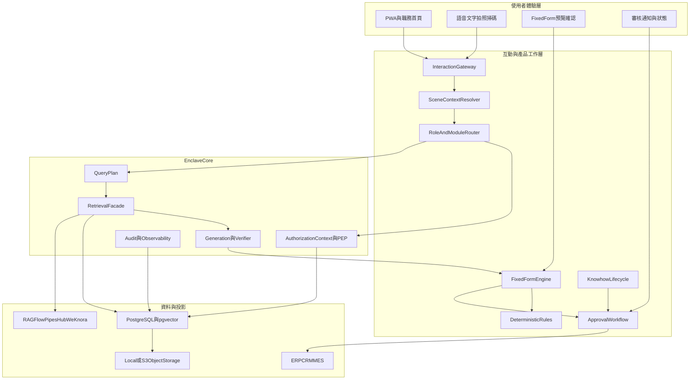

# 製造業知識助理商品化工程開發計畫

**文件版本**：1.0  
**建立日期**：2026-08-06  
**產品底座**：Enclave  
**文件定位**：`MANUFACTURING_KNOWLEDGE_ASSISTANT_PRODUCT_VISION.md` 的工程施工總綱  
**交付策略**：雲端優先、單一核心、中長期完整地端化  
**首批模組順序**：規格／SOP 共用底座 → 業務報價助理 → 現場異常／交接  
**進度語言**：獨立 `MKA-*` 閘門，不改寫既有 Triple Injection 主計畫完成率

---

## 0. 文件目的

本文件將產品願景轉成可以直接施工、驗收、部署與商業交付的工程計畫。

產品不是「增加語音功能的知識庫」，而是：

> **以 Enclave 的企業知識、權限與準確性為可信底座，讓製造業使用者透過職務場景、語音、掃碼與結構化確認，完成報價、查規格、異常紀錄、知識傳承等實際工作。**

本計畫同時解決四件事：

1. 保持並持續提升 Enclave 最重要的準確性。
2. 將 UIUX 提升為商品化後的另一個核心競爭力。
3. 建立可銷售、可授權、可啟停、可量測的職能模組。
4. 以同一套程式支援近期全雲端化與中長期地端／air-gap。

---

## 1. 工程北極星

### 1.1 雙重王道

Enclave 商品化後有兩個不可互相取代的王道：

#### 王道一：準確性

準確性決定企業能不能信任產品，包括：

- 找對文件
- 找對版本
- 引用正確來源
- 正式知識優先
- 關鍵數字不亂寫
- 證據不足時拒答
- 權限不足時看不到
- 雲端與地端結果不因部署方式而失真

#### 王道二：UIUX

UIUX 決定使用者會不會使用、持續使用與願意付費，包括：

- 不必理解 RAG、Prompt 或資料夾結構
- 不必輸入長文字
- 能從職務與任務直接開始
- 系統清楚顯示目前狀態與下一步
- 錯誤容易修正，不會造成不可逆後果
- 重要資料容易確認
- 來源資訊可信但不造成資訊過載
- 手機、手套、噪音與弱網環境仍可使用

**發布規則**：

> 後端準確但工作流程難用，不算商品完成；介面好看但答案不可靠，也不算商品完成。

### 1.2 商業北極星

產品銷售的是可量化結果，不是技術名詞：

- 查資料更快
- 報價製作更快
- 現場紀錄更完整
- 新人更快獨立作業
- 老師傅經驗可以被保存、審核與傳承
- 高風險輸出不會繞過人員確認

### 1.3 安全承諾

首版對外承諾是：

> **有來源、可控、需要人確認的製造業工作助理。**

首版不承諾：

- 任意文件、任意問題都正確
- 自動決定價格或折扣
- 自動簽發報價或合約
- 未經核准寫入 ERP／MES
- 語音永遠辨識正確
- AI 取代合格技術或安全人員判斷

---

## 2. 與既有 Enclave 計畫的關係

### 2.1 文件分工

```text
DEVELOPMENT_PLAN_TRIPLE_INJECTION.md
  └─ Enclave Core、sidecar、控制面與原商業 GA 主計畫

FOUNDATION_RETRIEVAL_AND_DELIVERY_PLAN.md
  └─ 入庫、多粒度檢索、融合與 QueryPlan 不變量

VISION_POINT_A_TO_B.md
  └─ 問答準確性與 Point B 路線

CLOUD_AND_COMMERCIALIZATION_PLAN.md
  └─ 雲端、地端、商業殼層與三種交付形態

MANUFACTURING_KNOWLEDGE_ASSISTANT_PRODUCT_VISION.md
  └─ 商品 WHAT／WHY

本文件
  └─ 製造業商品 HOW、施工順序與 MKA-* 閘門
```

### 2.2 不重做的正式主路徑

以下能力已存在，MKA 只能延伸，不能另起第二套：

```text
AuthorizationContext
→ QueryPlan
→ MultiStepOrchestrator
→ RetrievalFacade
→ Catalog／Chunk／Compiled／Gateway
→ refusal
→ source_verifier
→ streaming answer
```

既有主路徑：

- 問答：`app/api/v1/endpoints/chat.py`
- 編排：`app/services/chat_orchestrator.py`
- 多步檢索：`app/services/multi_step_orchestrator.py`
- 統一檢索：`app/services/retrieval_facade.py`
- 授權：`app/core/authorization.py`
- 拒答：`app/services/refusal.py`
- 來源驗證：`app/services/source_verifier.py`
- 生成：`app/api/v1/endpoints/generate.py`
- 報告：`app/api/v1/endpoints/reports.py`
- UI 能力 Bootstrap：`app/api/v1/endpoints/experience.py`

### 2.3 不混淆的既有骨架

#### 文件 Review Queue

`app/agent/review_queue.py` 解決的是：

```text
新文件／監控來源
→ AI 分類建議
→ 人工核准
→ 正式入庫
```

它不是報價、表單或外部寫入的業務簽核。

#### Agent Approval

`app/models/agent_approval.py` 與 API 已有工具批准骨架，但：

- 尚未完整接入正式 Chat
- 尚無完整前端
- 尚不是多級業務簽核狀態機

新計畫應復用它的風險與 fail-closed 概念，不應把它直接宣稱為 Fixed Form 審核完成。

#### GeneratedReport

`GeneratedReport` 可保存 Markdown 報告與來源，但不等於：

- JSON Schema 表單
- deterministic rule result
- 每欄位 provenance
- 表單版本
- 審核狀態
- 正式文件 immutable snapshot

---

## 3. 目標架構



### 3.1 架構不變量

| ID | 不變量 |
|---|---|
| MKA-INV-CORE | MKA 不得繞過 RetrievalFacade、PEP、refusal 與 source verifier |
| MKA-INV-AUTH | 每次檢索、工具、表單、審核都帶 tenant 與 AuthorizationContext |
| MKA-INV-KNOWLEDGE | 正式 SOP／規格優先於已審 know-how；草稿不可進正式答案 |
| MKA-INV-NUMBER | 金額、數量、稅額、MOQ、折扣與交期規則不得由 LLM 自由計算 |
| MKA-INV-HITL | 高風險輸出預設需確認與核准 |
| MKA-INV-PROVENANCE | 表單欄位必須能標示來源、規則或使用者輸入 |
| MKA-INV-DEPLOY | 雲端與地端共用資料模型、API、gate 與模組契約 |
| MKA-INV-UX | 主要任務無 UI E2E 與真實使用者驗收，不得標記完成 |
| MKA-INV-CLAIMS | 對外宣稱必須是已通過 gate 的能力子集 |

---

## 4. 領域資料模型

### 4.1 JobModule

不要將現有 `ProductModule` 直接拿來代表職能模組。

現有 `ProductModule` 是部署／sidecar pack：

- Base
- Document Intelligence
- Enterprise Connect
- Knowledge Compiler
- Agent Automation

新增的 `JobModule` 是使用者工作能力：

- `spec_sop`
- `sales_quote`
- `incident_handover`
- `quality_8d`
- `training_knowhow`

建議欄位：

```text
JobModule
  id
  module_key
  tenant_id nullable
  name
  description
  version
  status draft/enabled/disabled/deprecated
  allowed_roles
  allowed_departments
  knowledge_scope_policy
  supported_intents
  allowed_tools
  form_definition_ids
  approval_policy_id
  ux_entrypoints
  metrics_config
  created_by
  created_at
  updated_at
```

### 4.2 TenantModuleBinding

用途：

- 每家公司啟用不同模組
- 每家公司覆寫公司版型與規則
- 控制試用、授權與版本

重要欄位：

```text
tenant_id
module_key
module_version
enabled
license_state
config_json
effective_from
effective_to
```

### 4.3 InteractionSession

用於語音、文字、掃碼與跨步驟填表，不取代 Chat Conversation。

```text
InteractionSession
  id
  tenant_id
  user_id
  module_key
  channel web/pwa/app/line
  scene_context
  transcript
  transcript_confirmed_at
  detected_fields
  pending_questions
  risk_level
  state
  expires_at
```

### 4.4 SceneContext

SceneContext 必須是受驗證的結構，不是任意 prompt：

```text
site_id
plant_id
line_id
equipment_id
equipment_model
work_order_id
product_id
part_number
customer_id
document_version_scope
resolved_from qr/barcode/user/system
resolved_at
```

QR 只攜帶 opaque identifier；實際場景資料由後端解析，避免 QR 洩漏敏感資料或被任意注入 prompt。

### 4.5 TenantTermDictionary

用途：

- 公司專有名詞
- 料號
- 客戶名
- 設備代碼
- 中英混用
- 常見誤聽

```text
term
aliases
phonetic_hints
category
scope
active
source
last_verified_at
```

### 4.6 FormDefinition

```text
FormDefinition
  id
  tenant_id nullable
  form_key
  name
  schema_version
  json_schema
  ui_schema
  output_templates
  rule_set_id
  approval_policy_id
  status
  effective_from
```

`json_schema` 負責：

- 欄位型別
- required
- enum
- pattern
- min／max
- nested item

`ui_schema` 負責：

- 顯示順序
- 手機版 layout
- field widget
- 關鍵欄位醒目層級
- read-only／editable
- 來源顯示方式

### 4.7 FormInstance

```text
FormInstance
  id
  tenant_id
  form_definition_id
  form_version
  module_key
  owner_id
  status draft/pending_review/changes_requested/approved/finalized/void
  values_json
  provenance_json
  calculation_snapshot
  validation_result
  source_document_ids
  scene_context
  created_at
  updated_at
  finalized_at
```

每欄位 provenance 格式：

```json
{
  "field": "unit_price",
  "value": 120.0,
  "source_type": "rule",
  "source_ref": "pricing-policy-v7",
  "evidence": ["document-id", "chunk-id"],
  "confirmed_by": "user-id",
  "confirmed_at": "timestamp"
}
```

### 4.8 RuleSet

規則引擎首版採版本化、可測試的程式／宣告式規則，不做通用 BPMN。

```text
RuleSet
  id
  tenant_id
  rule_key
  version
  input_schema
  output_schema
  implementation_ref
  test_cases
  status
  approved_by
```

### 4.9 ApprovalPolicy／ApprovalRequest

業務簽核與工具批准應共用風險語言，但資料模型可分離。

```text
ApprovalPolicy
  id
  module_key
  object_type
  risk_level
  steps
  timeout_policy
  delegation_policy

ApprovalRequest
  id
  tenant_id
  object_type
  object_id
  policy_version
  current_step
  status
  submitted_by
  reviewers
  decision_log
  immutable_snapshot
```

正式輸出前必須保存 immutable snapshot，避免核准後內容被改。

### 4.10 KnowhowCard

```text
KnowhowCard
  id
  tenant_id
  title
  status draft/in_review/approved/rejected/retired
  authority_level
  applicable_roles
  equipment_ids
  product_ids
  customer_ids
  problem_context
  recommended_actions
  prerequisites
  risks
  prohibited_actions
  source_audio_uri
  transcript_id
  interviewee
  interviewer
  reviewer
  related_sop_ids
  conflict_report
  version
  effective_from
  expires_at
```

---

## 5. API 與服務邊界

### 5.1 新增 API 群組

建議新增：

```text
/api/v1/interaction/*
/api/v1/job-modules/*
/api/v1/forms/*
/api/v1/approvals/*
/api/v1/knowhow/*
/api/v1/scene/*
```

### 5.2 Interaction API

```text
POST /interaction/transcriptions
  音訊上傳 → STT → tentative transcript

POST /interaction/sessions
  建立 module／channel／scene session

PATCH /interaction/sessions/{id}/transcript
  人工修正與確認

POST /interaction/sessions/{id}/resolve
  Module Router → chat／form／tool
```

安全要求：

- 音訊大小、格式與時長限制
- ClamAV／MIME 檢查
- tenant object prefix
- 可設定不保存原音訊
- transcript 未確認不得觸發高風險動作

### 5.3 Scene API

```text
POST /scene/resolve
  qr_token／barcode
  → 驗證
  → 回 SceneContext
```

禁止直接把掃描字串拼入 prompt。

### 5.4 Module API

```text
GET /job-modules
GET /job-modules/{key}
POST /admin/job-modules/{key}/enable
PATCH /admin/job-modules/{key}/config
```

`experience/bootstrap` 擴充：

```json
{
  "job_modules": [],
  "default_job_home": "...",
  "interaction_capabilities": {
    "voice": true,
    "camera": true,
    "qr": true,
    "offline": false
  }
}
```

必須保留誠實狀態；provider 未設定時 UI 不顯示可用按鈕。

### 5.5 Fixed Form API

```text
GET /forms/definitions/{form_key}
POST /forms/instances
PATCH /forms/instances/{id}/fields
POST /forms/instances/{id}/extract
POST /forms/instances/{id}/calculate
POST /forms/instances/{id}/validate
POST /forms/instances/{id}/submit
POST /forms/instances/{id}/export
```

規則：

- extract 可以使用 LLM
- calculate 只能使用已核准 RuleSet
- validate 必須 deterministic
- export 需符合 approval policy

### 5.6 Approval API

```text
GET /approvals/inbox
GET /approvals/{id}
POST /approvals/{id}/approve
POST /approvals/{id}/reject
POST /approvals/{id}/request-changes
```

要求：

- idempotency key
- optimistic locking
- reviewer authorization
- stale version 拒絕
- 全程 audit

### 5.7 Know-how API

```text
POST /knowhow/interviews
GET /knowhow/cards
GET /knowhow/cards/{id}
PATCH /knowhow/cards/{id}
POST /knowhow/cards/{id}/submit
POST /knowhow/cards/{id}/approve
POST /knowhow/cards/{id}/retire
```

---

## 6. UIUX 商品化工程軌

### 6.1 UIUX 不是最後美化

UIUX 必須在資料模型與 API 前參與設計，因為：

- 使用者的工作順序決定 InteractionSession 狀態
- 使用者確認方式決定 Form schema 與 provenance
- 錯誤復原決定 workflow transition
- 現場環境決定 PWA、語音與掃碼技術
- 審核者需要的資訊決定 immutable snapshot

### 6.2 使用者研究

每個 Design Partner 至少完成：

1. 三角色訪談：業務、現場人員、主管。
2. 工作影隨：實際看一次查規格、報價、異常交接。
3. 現有工具盤點：Excel、Word、LINE、紙本、ERP。
4. 任務時間基線。
5. 常見錯誤與例外。
6. 資料敏感與批准邊界。
7. 裝置、噪音、網路、手套與光線環境。

研究產物：

```text
docs/research/mka/{tenant}/
  personas.md
  jobs_to_be_done.md
  current_journeys.md
  failure_modes.md
  baseline_metrics.json
```

客戶敏感內容不可直接提交到一般 repository；正式儲存應使用受控研究空間，repo 只保留匿名模板。

### 6.3 任務導向資訊架構

第一線首頁不顯示技術 pack 與管理功能。

業務首頁：

- 查規格
- 建立報價
- 最近草稿
- 等待補件
- 審核結果

現場首頁：

- 掃描設備
- 問 SOP
- 回報異常
- 建立交接
- 我的待辦

主管首頁：

- 待我審核
- 高風險差異
- 過期知識
- 模組成效

### 6.4 MKA Design System

在現有前端設計系統上增加 MKA pattern：

- `TaskCard`
- `PushToTalk`
- `TranscriptEditor`
- `CriticalFieldChip`
- `SceneContextBanner`
- `EvidenceCard`
- `AuthorityBadge`
- `FormFieldWithProvenance`
- `ApprovalTimeline`
- `OfflineState`
- `ConflictNotice`
- `RefusalRecovery`

要求：

- 手機優先
- 觸控目標建議至少 48×48 CSS px
- 繁體中文排版
- WCAG 2.2 AA 基線
- 關鍵狀態不只用顏色
- 高風險確認不可只靠 toast
- 所有動作有 loading、成功、失敗與重試狀態

### 6.5 Voice-first 互動

正確流程：

```text
按住說話
→ 顯示錄音狀態
→ STT
→ 顯示可編輯 transcript
→ 標出料號／金額／數量／客戶／日期
→ 使用者確認或修正
→ 才送入問答或表單流程
```

禁止：

- 錄音放開後直接送出正式動作
- 只顯示「辨識成功」而不顯示文字
- 低信心實體靜默通過
- 高風險資訊以 TTS 在公共現場朗讀

### 6.6 來源與信任 UI

避免把完整檢索 trace 直接丟給一般使用者。

採漸進揭露：

1. 答案或工作建議
2. 生效版本與權威標籤
3. 來源文件卡
4. 展開原文／頁碼
5. 進階 trace 僅管理者可見

拒答不可只說「找不到」，應提供安全下一步：

- 建議改用哪個場景
- 缺哪份文件
- 是否可請 owner 補充
- 是否建立待辦

### 6.7 狀態完整性

每一個主要任務都必須設計：

- loading
- empty
- partial data
- low confidence
- conflict
- refusal
- permission denied
- offline／weak network
- draft saved
- approval pending
- changes requested
- rejected
- finalized

### 6.8 UX 遙測

不得只追 page view。

建議事件：

```text
mka_task_started
mka_voice_recorded
mka_transcript_corrected
mka_critical_field_confirmed
mka_scene_resolved
mka_form_field_changed
mka_task_completed
mka_task_abandoned
mka_refusal_recovered
mka_approval_submitted
mka_approval_decided
```

隱私：

- 不把原始 transcript／金額／客戶名稱放進 analytics property
- 使用 hash／category／count
- 錄音保存採 opt-in 或 tenant policy

### 6.9 UIUX 初始驗收目標

以下是 Design Partner 初始目標，取得基線後可調整，但不得降低安全底線：

| 指標 | 初始門檻 |
|---|---|
| 首次使用者主要任務完成率 | ≥85% |
| 關鍵欄位未確認即提交 | 0 |
| 高風險誤提交 | 0 |
| 報價草稿時間 | 較現況降低 ≥40% |
| 規格／SOP 查詢完成時間 | 中位數 ≤90 秒 |
| 異常／交接草稿時間 | 中位數 ≤3 分鐘 |
| 錯誤後成功復原率 | ≥80% |
| UMUX-Lite 或等價分數 | ≥75 |
| WCAG 2.2 AA Critical | 0 |
| 手機 LCP | p75 ≤2.5 秒 |

---

## 7. 準確性持續工程

### 7.1 現況基線

已凍結的 unseen baseline：

- Blind Z3：67／85 pass
- Blind Z4：39／50 pass

約 78–79% 是嚴格一次跑分，不代表所有 review 都錯，也不能用後續 debug probe 覆蓋原始分數。

### 7.2 商品化前的 P0 補強

依 `UPSTREAM_CAPABILITY_ADOPTION_AUDIT_2026-08-06.md`：

1. Parent Document
2. Sibling Expansion
3. Context Fitting
4. query embedding cache
5. feature-flagged Multi-query ablation

不恢復 HyDE 預設；不整包引 OpenDocuments。

### 7.3 權威分級

建議 authority：

```text
100 formal_policy
90 approved_sop
80 approved_spec_or_contract
70 approved_case
60 approved_knowhow
20 external_reference
0 draft
```

draft 必須在 retrieval 前排除，不可只靠 rerank 降權。

### 7.4 商品模組評測

除一般問答外，新增：

- 指定設備／產品／客戶 scoped retrieval
- 版本有效性
- 正式 SOP 與 know-how 衝突
- 關鍵欄位抽取
- 規則輸出
- 表單 provenance
- refusal recovery

### 7.5 新 Hold-out

需建立 Z5：

- 不使用 Z3／Z4 文件
- 包含製造業 SOP、規格、報價、設備紀錄
- intent frozen
- GT 對 ingested chunks
- 一次跑分
- 修洞只用 debug probes

---

## 8. 分階段施工

> 時間為一般產品團隊的參考區間；AI 可加速程式施工，但 Design Partner 觀察、現場驗證、外部滲透與法律簽核不能用程式時間取代。

### MKA-P0：契約、準確性與研究基線

**參考區間**：2–4 週

#### 目標

- 固定 MKA 架構邊界
- 建立 module／form／scene／approval／authority schema
- 完成 UIUX 研究框架
- 補準確性 P0
- 建立 MKA gate framework

#### Backend

- 新增 JobModule 與 tenant binding schema
- 擴 `experience/bootstrap`
- 定義 SceneContext
- 定義 authority level
- 實作 Parent／Sibling／Context Fitting
- 建立 eval profile 與 answer／retrieval 同 run 診斷

#### Frontend／UX

- 完成三角色 journey
- 完成資訊架構
- 建立低擬真原型
- 建立 MKA Design System backlog

#### 建議檔案

```text
app/models/job_module.py
app/schemas/job_module.py
app/services/module_registry.py
app/services/module_router.py
app/services/context_expansion.py
tests/test_mka_module_contract.py
tests/test_mka_module_acl.py
scripts/eval_mka_p0_gate.py
eval_profiles/mka_p0.yaml
```

#### Gate

- `MKA-P0-MODULE-CONTRACT`
- `MKA-P0-ACL`
- `MKA-P0-RETRIEVAL`
- `MKA-UX-RESEARCH`
- 既有 `make foundation-gates`

#### Exit

- 模組不是 prompt
- 每次檢索帶 AuthorizationContext
- Z1／Z3／Z4 不回歸
- Design Partner 已確認主要任務旅程

---

### MKA-P1：PWA、Voice-first 與規格／SOP 助理

**參考區間**：4–6 週

#### 目標

第一個可用產品不是「聊天框」，而是手機可完成規格／SOP 任務的職務入口。

#### Backend

- InteractionSession
- STT provider interface
- 音訊 storage／retention
- TenantTermDictionary
- Scene resolver
- module-scoped retrieval
- 語音用量與成本記錄

#### Frontend

- PWA manifest／service worker 基礎
- JobHomePage
- PushToTalk
- TranscriptEditor
- CriticalFieldChip
- QR scanner
- SceneContextBanner
- EvidenceCard
- RefusalRecovery

#### STT Provider

以 adapter 抽象：

```text
SpeechToTextProvider
  transcribe
  health
  supports_vocabulary
  supports_timestamps
```

雲端與地端 provider 必須可替換；實際設定前需驗證模型與授權。

#### 建議檔案

```text
app/api/v1/endpoints/interaction.py
app/api/v1/endpoints/scene.py
app/models/interaction.py
app/models/term_dictionary.py
app/services/interaction/
app/services/speech/
frontend/src/pages/job/JobHomePage.tsx
frontend/src/components/mka/
frontend/public/manifest.webmanifest
tests/test_mka_voice_safety.py
scripts/eval_mka_stt_gate.py
```

#### Gate

- `MKA-P1-PWA`
- `MKA-P1-STT`
- `MKA-P1-SCENE`
- `MKA-P1-SOP`
- `MKA-UX-VOICE`
- `MKA-UX-MOBILE`

#### Exit

- 使用者不打長文字即可完成查規格／SOP
- transcript 可修正
- 關鍵實體需確認
- 語音不能直接觸發正式動作
- 真實手機、弱網與至少一種噪音條件通過

---

### MKA-P2：業務報價助理

**參考區間**：6–8 週

#### 目標

交付第一個可明確量化 ROI 的付費工作模組。

#### 流程

```text
業務語音或文字
→ 客戶／產品／數量／條件抽取
→ 顯示並確認
→ 查正式規格／價格政策／歷史參考
→ 追問缺欄
→ deterministic 計算
→ 報價 FormInstance
→ 預覽
→ 業務確認
→ 主管審核
→ PDF／Word
```

#### Backend

- FormDefinition／FormInstance
- JSON Schema validation
- slot-filling state
- PricingCalculator
- TaxCalculator
- Currency／rounding policy
- MOQ／delivery rule
- field provenance
- ApprovalWorkflow
- immutable approved snapshot
- template renderer

#### Frontend

- QuoteStart
- RecognizedFields
- MissingFields
- QuoteFormEditor
- RuleExplanation
- SourceDrawer
- ApprovalSubmit
- ApprovalInbox
- QuotePreview

#### 風險控制

- 歷史報價只能作參考，除非公司規則授權
- 折扣不由 LLM 決定
- 匯率要有日期與來源
- 稅額與 rounding 要版本化
- 核准後修改需建立新版本

#### 建議檔案

```text
app/models/fixed_form.py
app/models/approval_workflow.py
app/schemas/fixed_form.py
app/services/fixed_form/
app/services/rules/
app/services/approval/
app/api/v1/endpoints/forms.py
app/api/v1/endpoints/approvals.py
frontend/src/pages/modules/quote/
frontend/src/pages/approvals/
tests/test_mka_quote_rules.py
tests/test_mka_form_provenance.py
tests/test_mka_approval_flow.py
scripts/eval_mka_quote_e2e.py
```

#### Gate

- `MKA-P2-FORM-SCHEMA`
- `MKA-P2-RULES`
- `MKA-P2-PROVENANCE`
- `MKA-P2-APPROVAL`
- `MKA-P2-EXPORT`
- `MKA-UX-QUOTE`

#### Exit

- 關鍵欄位抽取正確率達標
- 規則案例 100% deterministic
- 未核准不可正式匯出
- 主管可看來源、規則與修改差異
- 報價草稿時間較現況降低至少 40%

---

### MKA-P3：現場異常／交接

**參考區間**：6–8 週

#### 目標

交付最能展現 Voice-first、掃碼與現場體驗的第二模組。

#### 流程

```text
掃設備或工單
→ SceneContext
→ 語音／文字／照片描述
→ 查正式 SOP 與歷史案例
→ 建議安全檢查順序
→ 使用者確認實際狀況
→ 異常／交接表單
→ 指派待辦
→ 班組長確認
```

#### Backend

- equipment／work-order scene adapter
- incident form schema
- attachment metadata
- safe guidance policy
- task assignment
- shift handover state
- notification outbox

#### Frontend

- ScanEquipment
- IncidentCapture
- PhotoAttachment
- SafeChecklist
- HandoverDraft
- TaskAssignment
- ShiftSummary

#### 安全邊界

- 不宣稱故障診斷取代維修人員
- 緊急／危險關鍵字優先顯示停機與聯絡程序
- 不在證據不足時提供高風險操作步驟
- 照片分析初期只作附件與人工檢視；若加入視覺模型需獨立 gate

#### Gate

- `MKA-P3-SCENE-SCOPE`
- `MKA-P3-INCIDENT-FORM`
- `MKA-P3-SAFETY`
- `MKA-P3-HANDOVER`
- `MKA-UX-FIELD`

#### Exit

- 工廠噪音與手套情境可用
- 錯設備文件率較無 scene 顯著下降
- 異常草稿中位數三分鐘內
- 安全高風險誤建議為 0

---

### MKA-P4：職能模組平台化

**參考區間**：4–6 週

#### 目標

從兩個客製模組進化為可重複銷售的模組平台。

#### 工程

- Module Registry admin
- tenant module enable／disable
- module version migration
- role／department／tool／form policy
- module usage dashboard
- module license／quota
- module export／import package
- module compatibility matrix

#### 關鍵證明

新增第三模組時，不修改：

- `chat.py`
- `multi_step_orchestrator.py`
- 核心 PEP

#### Gate

- `MKA-P4-REGISTRY`
- `MKA-P4-TENANT-BINDING`
- `MKA-P4-MODULE-ACL`
- `MKA-P4-MODULE-UPGRADE`
- `MKA-P4-METRICS`

---

### MKA-P5：Know-how 與知識傳承

**參考區間**：6–8 週

#### 目標

將語音訪談變成可治理的企業資產，而不是未審文字直接污染知識庫。

#### 流程

```text
錄音
→ STT
→ draft zone
→ 分段與主題
→ 知識卡草稿
→ SOP 差異與風險
→ 資深人員／主管審核
→ approved know-how
→ 才進正式索引／Wiki
```

#### 技術

- audio／transcript lineage
- KnowhowCard
- draft isolation
- authority tier
- conflict detector
- reviewer UI
- expiry／review reminder
- retire／revoke
- source verifier 支援知識卡引用

#### Gate

- `MKA-P5-DRAFT-ISOLATION`
- `MKA-P5-AUTHORITY`
- `MKA-P5-CONFLICT`
- `MKA-P5-PUBLISH`
- `MKA-P5-REVOKE`
- `MKA-UX-KNOWHOW`

#### Exit

- 未審錄音內容在正式回答命中數為 0
- 每張核准卡有來源、審核者、版本與有效期
- 與 SOP 衝突時正式 SOP 優先並顯示差異

---

### MKA-P6：企業系統整合與有限自動化

**參考區間**：客戶需求驅動

#### 順序

1. read-only 查詢
2. 資料預填
3. 核准後 low-risk write
4. 高風險寫入保持人工

#### 候選

- CRM 客戶主檔
- ERP 料號／價格／庫存／交期
- MES 工單／設備
- 維修系統

#### 技術選擇

- 文件同步：PipesHub／Connector
- 即時工具：REST adapter 或 MCP client
- 大量文件不走 MCP
- 每一系統獨立認證

#### 寫入護欄

- least privilege
- idempotency key
- approval token
- immutable payload
- retry policy
- compensation／rollback
- audit correlation id
- fail-closed

#### Gate

- `MKA-P6-CONNECTOR-READ`
- `MKA-P6-ACL`
- `MKA-P6-WRITE-HITL`
- `MKA-P6-IDEMPOTENCY`
- `MKA-P6-ROLLBACK`

---

## 9. 雲端優先與地端化

### 9.1 原則

近期商業主路徑是全雲端化，但中長期地端不是另一套產品。

必須維持：

- 單一 repository
- 單一資料模型
- 單一 API
- 單一 module package
- 單一 migration chain
- 單一 MKA gate

差異只能放在 provider／adapter／deployment profile。

### 9.2 三種交付形態

| 能力 | Managed Private Cloud | Multi-tenant SaaS | On-prem／Air-gap |
|---|---|---|---|
| 近期定位 | 首批 Design Partner 與最快變現 | 規模化 | 中長期企業／敏感客戶 |
| 隔離 | 每客一套 | RLS＋object prefix＋sidecar binding | 實體單實例 |
| Storage | S3／R2 | S3／R2 tenant prefix | local／MinIO |
| STT | 雲端 API | 雲端 API | 本地 STT |
| LLM | 雲端品質模型 | 雲端品質模型 | 本地或客戶核准 provider |
| Embedding | Voyage 或雲端 | Voyage 或雲端 | bge-m3／本地 |
| OCR | 雲端 OCR | 雲端 OCR | 本地 DeepDoc／OCR |
| RLS | 建議 shadow | enforce | 可選；單租戶仍保留 tenant |
| Sidecar | per-customer | binding map | per-customer |
| 更新 | fleet 管理 | CI/CD | signed offline bundle |
| 遙測 | 完整但脫敏 | 完整但脫敏 | 可關／local export |

### 9.3 Capability-driven UI

不同 profile 不得出現假功能。

Bootstrap 應回：

- voice provider ready
- camera available
- qr available
- offline available
- module enabled
- connector certified
- external inference boundary

UI 根據真實能力顯示、禁用或解釋替代路徑。

### 9.4 地端必要工程

在 MKA-P1 起就維持 abstraction，但中長期地端 GA 需補：

- 本地 STT provider
- 本地 TTS 可選
- 離線 term dictionary
- 音訊 local retention
- 無外網 license grace
- signed module pack
- offline migration
- support bundle
- local observability
- air-gap SBOM／NOTICE
- N-1 upgrade／rollback

### 9.5 雲端必要工程

沿用 `CLOUD_AND_COMMERCIALIZATION_PLAN.md`：

- StorageBackend
- RLS
- sidecar tenant binding
- SSO／MFA
- quota
- billing
- ClamAV
- Sentry／Langfuse／Prometheus
- data export／deletion
- capacity gate
- cloud pentest

MKA 不重做這些，只增加：

- voice usage／cost axis
- module license／usage
- form／approval audit
- audio retention
- PWA distribution

---

## 10. Gate 與進度控制

### 10.1 獨立進度語言

建立：

```text
make mka-gates
scripts/mka_progress_gate.py
artifacts/mka_*
```

不修改 `plan_progress_gate.py` 的主計畫統計來源，避免把新產品計畫混入既有 47／48 或其他主計畫數字。

### 10.2 Gate 分類

| 前綴 | 用途 |
|---|---|
| MKA-ACC-* | 準確性、來源、拒答、欄位正確 |
| MKA-UX-* | 任務完成、真機、無障礙、錯誤復原 |
| MKA-MOD-* | 模組契約、ACL、版本、啟停 |
| MKA-FORM-* | schema、規則、provenance、輸出 |
| MKA-APPROVAL-* | 簽核、冪等、immutable snapshot |
| MKA-KH-* | know-how 草稿隔離與發布 |
| MKA-INT-* | 外部整合 |
| MKA-DEPLOY-* | 雲端／地端 parity |

### 10.3 Artifact 基本格式

```json
{
  "gate": "MKA-...",
  "status": "pass",
  "generated_at": "...",
  "git_sha": "...",
  "profile": "managed_cloud",
  "tenant_fixture": "...",
  "metrics": {},
  "failures": [],
  "evidence": []
}
```

禁止手寫 `status: pass` 取代執行。

### 10.4 發布組合

#### 開發分支

```text
unit + lint + targeted MKA gate
```

#### MKA Pilot

```text
make foundation-gates
make vision-gates
make mka-gates
managed_poc_smoke 或 on-prem smoke
```

#### 商業 GA

```text
上述全部
+ security scan
+ deployment profile parity
+ HG-PENTEST-CLOUD 或地端 HG-PENTEST
+ HG-LEGAL
+ 客戶 UAT
+ Claims 對帳
```

---

## 11. 測試策略

### 11.1 Test Pyramid

#### 單元

- module policy
- form validation
- rule calculations
- workflow transitions
- authority comparison
- STT post-processing

#### 整合

- authz + module scope
- scene + retrieval
- form + rules + provenance
- approval + export
- know-how publish + retrieval
- provider adapter

#### E2E

- 業務完整報價
- 現場完整異常／交接
- 主管審核
- 雲端／地端同流程

#### Blind／Adversarial

- Z5
- 錯設備 QR
- 惡意 QR prompt injection
- 語音金額誤聽
- 未核准 export
- stale approval
- 草稿 know-how 洩漏
- 跨 tenant／department

### 11.2 UI 測試

- component states
- responsive viewport
- Playwright real journey
- microphone permission denial
- camera permission denial
- weak network
- offline
- screen reader
- keyboard access
- touch target
- low-end Android device

### 11.3 Rule Golden Tests

報價至少包含：

- 稅內／稅外
- 不同幣別
- rounding
- MOQ 以下
- 多級數量折扣
- 特殊客戶例外
- 無價格政策拒絕
- 過期價格政策拒絕

### 11.4 UX 研究不可用自動測試代替

以下需真人：

- 第一次使用是否知道從哪開始
- 語音修正是否自然
- 來源資訊是否看得懂
- 主管是否能判斷該不該核准
- 現場戴手套是否能完成
- 拒答後是否知道下一步

---

## 12. Security、Privacy 與治理

### 12.1 音訊

- tenant policy 決定是否保存
- 預設保存 transcript，不一定保存 audio
- 支援 retention 與硬刪
- object storage 加密
- audit download
- 不將敏感 transcript 傳進 analytics

### 12.2 Prompt Injection

輸入來源包括：

- 語音
- QR
- 條碼
- 圖片 OCR
- 外部系統

都必須視為 untrusted。

控制：

- 結構化解析
- allowlist scene fields
- QR opaque token
- tool allowlist
- output schema
- source verifier

### 12.3 表單與審核

- approval 只對 immutable snapshot
- 變更後重新送審
- reviewer 不得核准自己無權限看的來源
- export token 短效
- 正式文件 watermark／version

### 12.4 Know-how

- 訪談同意與錄音政策
- 個資／營業秘密分類
- draft isolation
- expiry
- owner
- revoke

---

## 13. Observability、成本與 SLO

### 13.1 Trace

一次 MKA 任務應有同一 correlation ID：

```text
interaction
→ STT
→ module routing
→ retrieval
→ generation
→ form extraction
→ rules
→ approval
→ export
```

### 13.2 指標

#### 準確性

- document hit
- wrong-document rate
- source verification
- refusal reason
- field extraction accuracy
- rule mismatch

#### UX

- task completion
- time on task
- correction count
- re-record count
- abandonment
- recovery
- approval turnaround

#### 商業

- active tenants
- active modules per tenant
- time saved
- module adoption
- COGS per completed task

#### 營運

- STT latency／error
- chat latency
- form latency
- export failure
- queue delay
- provider 429

### 13.3 初始 SLO

| 項目 | 初始目標 |
|---|---|
| PWA availability | 99.5% Pilot；GA 再提高 |
| STT p95 | ≤8 秒／短語音 |
| 普通問答 first useful response | p95 ≤5 秒 |
| 表單保存 | p95 ≤1 秒 |
| 審核狀態一致性 | 100% |
| 未核准正式輸出 | 0 |
| 跨租戶洩漏 | 0 |

### 13.4 COGS

每個完成任務記錄：

- STT
- LLM
- embedding
- rerank
- OCR
- source verifier
- storage

產品不得靠關閉準確性路徑提高毛利；應以方案、配額與模組價格吸收。

---

## 14. Design Partner 與商業 Rollout

### 14.1 首批範圍

- 一家製造業 Design Partner
- 三種角色
  - 業務
  - 現場／設備人員
  - 主管／審核者
- 共同能力
  - 規格／SOP
- 第一付費模組
  - 業務報價
- 第二模組
  - 異常／交接

### 14.2 導入階段

#### Day 0：商業與資料邊界

- 成功指標
- 角色
- 資料範圍
- 錄音政策
- 模型資料出境
- 雲端／地端 profile

#### Week 1：研究與盤點

- 工作影隨
- 文件盤點
- 權限
- 表單
- 規則
- 詞典
- baseline time

#### Week 2–3：原型

- clickable prototype
- 5–8 位代表使用者任務測試
- 修正資訊架構

#### Build／Pilot

- tenant config
- module
- UAT
- 兩週受控上線
- 每週問題回顧

#### 4 週成效

- 任務時間
- 完成率
- 人工修改
- 錯誤
- 活躍
- 是否付費續用

### 14.3 可售包裝

#### 核心包

- 文件入庫
- 權限
- 規格／SOP
- 來源
- 拒答

#### 業務報價模組

- Fixed Form
- 規則
- 審核
- 公司版型

#### 現場異常模組

- 語音
- QR
- 異常／交接表單
- 任務追蹤

#### 知識傳承模組

- 訪談
- 知識卡
- 審核
- 版本與訓練

### 14.4 停止／回退條件

以下任一發生，不可擴大 rollout：

- 準確性回歸
- 高風險誤提交
- 跨權限洩漏
- 使用者任務完成率低於 70%
- 人工修改幅度過高，沒有節省時間
- STT 修正成本高於打字
- 導入規則無 owner
- 客戶無法提供正式表單與政策

---

## 15. 工程檔案落點總表

### Backend

```text
app/models/
  job_module.py
  interaction.py
  fixed_form.py
  approval_workflow.py
  knowhow.py
  term_dictionary.py

app/schemas/
  job_module.py
  interaction.py
  fixed_form.py
  approval_workflow.py
  knowhow.py

app/services/
  module_registry.py
  module_router.py
  context_expansion.py
  interaction/
  speech/
  scene/
  fixed_form/
  rules/
  approval/
  knowhow/

app/api/v1/endpoints/
  interaction.py
  scene.py
  job_modules.py
  forms.py
  approvals.py
  knowhow.py
```

### Frontend

```text
frontend/src/pages/job/
frontend/src/pages/modules/spec-sop/
frontend/src/pages/modules/quote/
frontend/src/pages/modules/incident/
frontend/src/pages/approvals/
frontend/src/pages/knowhow/
frontend/src/components/mka/
frontend/src/services/interaction.ts
frontend/src/services/modules.ts
frontend/src/services/forms.ts
frontend/src/services/approvals.ts
frontend/public/manifest.webmanifest
```

### Tests／Eval

```text
tests/test_mka_*.py
frontend/src/**/*.test.tsx
frontend/e2e/mka-*.spec.ts
scripts/eval_mka_*_gate.py
scripts/mka_progress_gate.py
eval_profiles/mka_*.yaml
testdata/golden/mka_*.yaml
artifacts/mka_*
```

### Migrations

每 Phase 分 migration，不一次建立所有未使用表：

```text
mka_p0_module_contract_001
mka_p1_interaction_voice_001
mka_p2_fixed_form_approval_001
mka_p3_incident_handover_001
mka_p5_knowhow_lifecycle_001
```

---

## 16. 風險登記

| ID | 風險 | 等級 | 控制 |
|---|---|---|---|
| MKA-R1 | 商品化趕進度造成準確性回歸 | 極高 | MKA-ACC 與 VISION gate 阻擋發布 |
| MKA-R2 | UI 做成聊天框加按鈕 | 高 | 任務旅程、原型與 UX gate |
| MKA-R3 | Voice-first 變 Voice-only | 高 | 文字、選單、掃碼 fallback |
| MKA-R4 | 金額／料號誤聽 | 極高 | CriticalField 確認；零自動提交 |
| MKA-R5 | Fixed Form 仍是自由 Markdown | 極高 | JSON Schema、rules、provenance |
| MKA-R6 | Review Queue 與業務簽核混淆 | 高 | domain 分離；共用風險語言 |
| MKA-R7 | 未審 know-how 污染正式答案 | 極高 | draft isolation |
| MKA-R8 | 雲端與地端分叉 | 高 | provider adapter、同 gate、同 migration |
| MKA-R9 | 過多 sidecar 增加維運 | 中 | 原生 port 優先；optional profile |
| MKA-R10 | 導入高度客製無法產品化 | 高 | P4 registry、版本化 schema |
| MKA-R11 | 使用者不用 | 極高 | 現場研究、任務完成率、停止條件 |
| MKA-R12 | 錄音與個資風險 | 高 | retention、consent、encryption、audit |

---

## 17. Definition of Done

一項 MKA 功能只有同時符合以下條件才算完成：

### 工程

- schema／migration
- API
- authorization
- audit
- error handling
- rollback
- tests

### 準確性

- source
- refusal
- field correctness
- no wrong-document regression
- hold-out or scenario eval

### UIUX

- happy path
- failure states
- mobile
- accessibility
- real-device E2E
- Design Partner task test

### 商業

- module license／enable
- usage／COGS
- support／runbook
- Claims

### 部署

- managed cloud
- SaaS if applicable
- on-prem compatibility or explicit deferred gate

---

## 18. 第一個完整商品里程碑

第一個可收費 MKA 版本完成定義：

```text
1 家 Design Partner
× 3 種角色
× Managed Private Cloud
× 規格／SOP 助理
× 業務報價助理
× PWA Voice-first
× Fixed Form
× deterministic rules
× 主管審核
× PDF／Word
× 來源與稽核
```

必過：

- Foundation gates
- Vision／answer gates
- MKA-P0～P2 gates
- MKA-UX Voice／Quote
- Cloud release gate
- 客戶 UAT
- 外部安全／法律要求

第二個商品里程碑：

- 現場異常／交接
- QR／場景
- 工廠現場 UX

第三個商品里程碑：

- 模組平台
- Know-how
- 企業 read-only 整合

---

## 19. 明確不做

1. 不重寫 Enclave 問答核心。
2. 不以 Langflow 建第二套編排。
3. 不整包引入 WeKnora／OpenKB／OpenDocuments。
4. 不先做原生 APP；PWA 驗證後再決定。
5. 不在第一版做大量自訂 workflow builder。
6. 不讓 LLM 自由計算正式金額。
7. 不讓錄音轉寫直接發布。
8. 不先做 40 個 connector 再找需求。
9. 不以漂亮 Demo 取代 hold-out 與 UX 任務測試。
10. 不以教育訓練掩蓋不合理介面。
11. 不為雲端砍掉地端抽象。
12. 不在人工／法律／滲透 gate 未關時宣稱商業 GA。

---

## 20. 立即施工順序

1. 建立 MKA 架構 ADR：Core／Work Layer／Sidecar 邊界。
2. 建立 JobModule／TenantModuleBinding 契約。
3. 擴 `experience/bootstrap`，回傳 job modules 與真實 interaction capabilities。
4. 建立 `mka_progress_gate.py` 與 P0 artifact schema。
5. 實作 Parent／Sibling／Context Fitting 與 eval profile。
6. 啟動 Design Partner 三角色研究。
7. 建立 MKA Design System 原型。
8. 建立 Interaction Gateway 與 STT adapter。
9. 交付 PWA 規格／SOP 助理。
10. 建立 Fixed Form／Rule／Approval。
11. 交付報價助理。
12. 以真實成效決定 P3 rollout。

---

## 21. 最終決策

本計畫採以下不可逆方向：

1. **準確性持續是 Enclave 技術核心。**
2. **UIUX 是 Enclave 商品化後的產品核心。**
3. **產品以工作模組銷售，不以聊天功能銷售。**
4. **規格／SOP 是共同底座，報價是第一付費模組，異常／交接是第二模組。**
5. **雲端優先，但同一套核心必須可走向完整地端與 air-gap。**
6. **正式資料與交易採人機協作，不在第一版追求無人化。**
7. **所有完成宣稱同時需要程式、準確性、UIUX、商業與部署證據。**

---

## 22. 關聯文件

- `docs/MANUFACTURING_KNOWLEDGE_ASSISTANT_PRODUCT_VISION.md`
- `docs/UPSTREAM_CAPABILITY_ADOPTION_AUDIT_2026-08-06.md`
- `docs/CLOUD_AND_COMMERCIALIZATION_PLAN.md`
- `docs/VISION_POINT_A_TO_B.md`
- `docs/FOUNDATION_RETRIEVAL_AND_DELIVERY_PLAN.md`
- `docs/CAPABILITY_ACTIVATION_AND_VALUE_PROOF_PLAN.md`
- `docs/CAPABILITY_CLAIMS.md`
- `docs/OPEN_GATES.md`
- `docs/DEVELOPMENT_PLAN_TRIPLE_INJECTION.md`

---

*本文件是商品化工程施工總綱，不是能力完成聲明。進度只能由 MKA-*、既有 FD／VISION／CG 閘門、真實 Design Partner 任務測試與必要人工簽核共同證明。*
