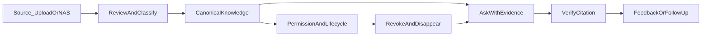

# Enclave 2.0 UI/UX 規劃書

> 狀態：**規劃書實作完成（UX-0～UX-4 + §10/§11/§16）**（2026-08-01）  
> 產品定位：地端企業知識 **Control Plane**（Pilot／受控部署，非商業 GA）  
> 產物用途：產品、設計、前端、後端契約對齊之單一真相來源  
> UX-1：能力導航殼、總覽、lazy routes、來源誠實面  
> UX-2：`GET /experience/bootstrap`、文件詳情時間軸、三欄審核台、問答證據抽屜、首次設定指引、推論邊界橫幅  
> UX-3：治理／系統文案、能力包儀表板、ConfirmDialog 清掃、檢索 degraded SSE＋引用 revision  
> UX-4：創作工作區 `/create`（新建｜報告）、舊路由 redirect、使用者選單入口  
> 補齊：AsyncState／錯誤追蹤、共用元件、EvidenceCard、來源分步、a11y focus trap、無證據降級

---

## 0. 摘要

Enclave 2.0 不是通用聊天機器人，而是「可信、可治理、資料邊界可控」的企業知識控制面。

**一句話價值**：讓企業知識問得到、證據找得到、權限守得住、內容撤得掉。

**體驗北極星**：

- 員工在最少阻力下取得**帶證據**的答案。
- 管理員能看懂一份知識從**來源 → 審核 → 入庫 → 被引用 → 撤銷**的完整生命週期。
- 介面只露出真實可用能力；強大能力採漸進揭露，不把 Control Plane 複雜度丟給非技術使用者。

**本階段決策**：

| 決策 | 內容 |
|------|------|
| 角色分流 | 員工首屏＝問答；Admin／Owner 首屏＝總覽 |
| V1 主導航 | 員工 ≤2；管理員 ≤5 |
| V1 來源 | 手動上傳 + NAS／監控資料夾 |
| V1.1 | 內容生成／報告併入「創作」 |
| 不做 V1 | Mobile、Wiki／Graph 編輯、未認證 connector、ReAct／MCP／Sandbox、SSO 入口 |
| 成熟度宣稱 | Pilot／受控部署；禁止「商業 GA／零風險」 |

---

## 1. 為什麼現在重做 UI

後端已收斂為 Control Plane + 可選 sidecar packs；前端仍是 Phase 功能堆疊：

| 現況問題 | 證據（前端） | 對使用者的傷害 |
|----------|--------------|----------------|
| 導航以開發階段命名 | `Layout.tsx`：Agent、KB 健康、連接器、知識編譯並列 | 看不懂「該去哪做什麼」 |
| 三條進料路徑 | 文件上傳／Agent／Connectors | 同一件事有三個入口 |
| 雙重「知識缺口」 | Query Analytics vs KB Health | 名詞衝突、誤判同一功能 |
| 問答垂直寫死 | Chat 空狀態「人資相關」 | 與通用企業知識定位不符 |
| 刪除語意過時 | Documents「刪除／無法復原」 | 掩蓋 deny-first 撤銷真相 |
| 未認證 connector 可選 | Connectors 含 SP／Drive | 產品表面寬於真實支援面 |
| 錯誤靜默 | 多頁 `catch { // ignore }` | 空白列表、無重試 |
| 角色不一致 | 前端 `manager`、後端 `UserRole` 無此值 | 審核旅程斷裂 |

產品尚未真實上線、無遷移包袱 → **一次對齊 2.0 敘事**，不保留長期第二套舊 IA。

---

## 2. 目標客群與易用性承諾

主要客群：**需要地端治理、但沒有大型知識管理團隊的台灣中大型組織**。

| 優先序 | 角色 | 心智模型 | 不應要求理解 |
|--------|------|----------|--------------|
| 1 | 日常員工（employee／viewer） | 提問 → 看答案 → 核對證據 | RAG、向量、chunk、sidecar |
| 2 | 內容負責人／HR | 上傳 → 等待處理 → 可被問到／需處理 | Agent、connector 協議 |
| 3 | Owner／Admin | 來源 → 審核 → 可用知識 → 品質與權限 | 環境變數、worker 細節 |
| 4 | IT／Superuser | Core／能力包／投影／部署健康 | —（可看技術診斷） |

**體驗承諾**：

1. 不用讀說明書也能從畫面判斷「這裡能做什麼」。
2. 登入後只看到與當下任務有關的入口。
3. 漸進揭露：結果與下一步 → 治理細節 → 技術診斷。
4. 每頁一個主要行動；進階設定不與首次任務搶注意力。
5. 安全預設、即時驗證、影響說明、可復原路徑。
6. 「成功」＝目標使用者**第一次**就能完成任務並理解結果。

---

## 3. 產品溝通架構

### 3.1 三層溝通（介面永遠先講成果）

1. **成果**：用可信證據回答企業問題。  
2. **控制**：每份知識有來源、審核、權限與撤銷狀態。  
3. **技術**：地端部署與可關閉能力包（僅 IT／Admin 展開）。

登入頁、空狀態、錯誤、功能說明皆依此順序。

### 3.2 價值支柱

| 支柱 | 使用者可感知行為 |
|------|------------------|
| 資料主權 | 顯示目前本機／外部模型與資料邊界；禁止無條件「資料永不離境」 |
| 可信答案 | 答案與證據同時出現；可定位文件／版本／段落 |
| 治理閉環 | 來源→審核→入庫→引用→更新→撤銷皆有狀態與下一步 |
| 最小權限 | 未授權內容不出現在搜尋／問答／引用；無權限不洩漏資源存在 |
| 模組自主 | 能力包關閉時移除入口；不顯示壞掉功能 |

### 3.3 宣稱邊界（Must NOT Overclaim）

- 禁止：商業 GA、production-ready、零風險、滲透通過、安全認證完成。  
- NAS 為 V1 **唯一已認證** connector；SP／Drive 不進建立流程。  
- Wiki／Graph＝API-only；Graph 無正式寫入。  
- SSO 未掛正式 router；Mobile／ReAct／MCP／Sandbox＝experimental。  
- 「刪除」不得宣稱全球瞬間清除；應為「立即拒絕存取；投影收斂中」。  
- 檢索降級無 API 旗標前，不宣稱「已搜尋所有來源」。

---

## 4. 角色與能力矩陣

### 4.1 正式後端角色

`owner`｜`admin`｜`hr`｜`employee`｜`viewer`｜平台級 `is_superuser`

**V1 不承認 `manager` 為正式角色**（前端／部分 API 殘留須對齊移除或另開 permission migration）。

### 4.2 能力（Capability）矩陣

| Capability | owner | admin | hr | employee | viewer | superuser |
|------------|:-----:|:-----:|:--:|:--------:|:------:|:---------:|
| `ask` | ✓ | ✓ | ✓ | ✓ | ✓ | ✓ |
| `browse_knowledge` | ✓ | ✓ | ✓ | ✓ | ✓ | ✓ |
| `upload_documents` | ✓ | ✓ | ✓ | — | — | ✓ |
| `manage_sources` | ✓ | ✓ | — | — | — | ✓ |
| `review_queue` | ✓ | ✓ | — | — | — | ✓ |
| `governance` | ✓ | ✓ | 稽核部分 | — | — | ✓ |
| `system_ops` | ✓* | ✓* | — | — | — | ✓ |
| `create_content` | ✓ | ✓ | ✓ | ✓ | ✓† | ✓ |

\* tenant 可見健康／備份；superuser 專屬 preflight／feature flags 不得假裝成一般 Admin 功能。  
† viewer：V1 可隱藏生成入口（唯讀）。

前端以 **capability registry** 產生路由與導航，禁止每頁手寫 `roles.includes(...)`。

---

## 5. 核心體驗模型

管理員介面必須讓這條鏈可見；不得拆成互不相關的「文件／Agent／健康度／連接器」孤島。

---

## 6. 資訊架構（V1）

### 6.1 員工導航（≤2）

| 項目 | 路由 | 說明 |
|------|------|------|
| 問答 | `/ask`（預設） | 對話、證據、回饋 |
| 知識 | `/knowledge/documents` | 僅可存取文件瀏覽 |

使用者選單：`/me/usage`、帳號、登出。

### 6.2 管理員導航（≤5）

| 項目 | 路由 | 說明 |
|------|------|------|
| 總覽 | `/overview`（預設） | 待辦優先，非 KPI 牆 |
| 問答 | `/ask` | 同員工；可切「測試知識」 |
| 知識 | `/knowledge/*` | 文件｜來源｜審核｜品質 |
| 治理 | `/governance/*` | 部門｜成員｜稽核｜問答品質 |
| 系統 | `/system/*` | 能力包｜健康｜備份｜部署 |

### 6.3 HR 導航

問答｜知識（含上傳）｜個人用量。不顯示來源／審核／系統。

### 6.4 V1.1

**創作** `/create`：合併內容生成與報告（員工第 3 或第 5 項，視測試決定）。

---

## 7. 舊頁去留與路由遷移矩陣

| 現況 | 處置 | 新路由 | 備註 |
|------|------|--------|------|
| `ChatPage` `/` | 改名重做 | `/ask` | 去 HR 化；證據一等公民 |
| `DocumentsPage` | 併入知識 | `/knowledge/documents` | 生命週期＋撤銷 |
| `ConnectorsPage` | 合併 | `/knowledge/sources` | 僅 NAS／上傳 |
| `AgentPage` 資料夾 | 合併 | `/knowledge/sources` | 改稱監控啟用 |
| `AgentPage` 進度 | 合併 | `/knowledge/review` 子區 | 取消獨立側欄 |
| `ReviewQueuePage` | 重做 | `/knowledge/review` | 三欄工作台 |
| `KBHealthPage` gaps／分類 | 拆分 | `/knowledge/quality` | 「結構化缺口」 |
| `KBHealthPage` 完整性／備份 | 拆分 | `/system/operations` | |
| `QueryAnalyticsPage` | 遷移 | `/governance/insights` | 「未答覆問題」≠缺口 |
| `AuditLogsPage` | 遷移 | `/governance/audit` | |
| `DepartmentsPage` | 遷移 | `/governance/departments` | |
| `CompanyPage` | 遷移 | `/governance/organization` | 統一命名 |
| `UsagePage` | 降級 | `/me/usage` | Admin 資源用量進治理 |
| `KnowledgeCompilerPage` | 降級 | `/system/modules` | 不進主導航 |
| `GeneratePage`＋`Reports*` | V1.1 | `/create` | 暫 redirect 保留 |
| `/my-usage`、`/agent/progress` | redirect | 新路徑 | 短期相容 |

舊路由保留 **301／Navigate redirect**；不保留舊 Layout 雙軌。

---

## 8. 名詞與狀態字典

### 8.1 使用者語言

| 禁止／技術詞 | 使用者詞 |
|--------------|----------|
| Connector | 來源 |
| Agent 設定 | 監控資料夾／自動入庫 |
| Delete | 撤銷知識 |
| Citation／chunk | 證據／處理片段（IT 詳情才用 chunk） |
| KB 健康度 | 知識品質／系統健康（依頁面拆分） |
| 知識缺口（混用） | **未答覆問題** vs **結構化缺口** |

### 8.2 文件生命週期（UI 統一）

| UI 狀態 | 含義 | 使用者下一步 |
|---------|------|--------------|
| `uploading` | 上傳中 | 等待 |
| `pending_review` | 待審核；暫不可搜尋 | 去審核（Admin） |
| `processing` | 解析／向量化中 | 可離頁；稍後刷新 |
| `searchable` | 可被問到（對應 completed／indexed） | 測試提問 |
| `failed` | 處理失敗 | 重試／查看原因 |
| `revoked` | 已撤銷；問答立即不可見 | 確認投影收斂 |

未知狀態不得預設顯示為「失敗」。

### 8.3 能力包狀態

`enabled`｜`disabled`｜`degraded`｜`unavailable` — 關閉時移除導航；深連結顯示說明頁。

---

## 9. 關鍵畫面規格

### 9.1 登入

- 品牌：Enclave；副標溝通「企業知識控制面／地端 Pilot」。  
- 顯示組織名稱（若可知）；**不展示 SSO**。  
- 若部署為外部模型，登入後橫幅說明推論邊界。

### 9.2 首次啟用（Admin／Owner，4 步）

1. 確認系統健康  
2. 上傳範例或接 NAS  
3. 審核第一批知識  
4. 測試提問驗證證據  

每步：必要欄位、完成條件、預估時間、進度、「稍後完成」；進階選項摺疊。提供安全範例文件，無需先準備正式 NAS。

### 9.3 管理員總覽 `/overview`

- 首屏＝**需要處理的事**＋一條生命週期狀態帶。  
- 待辦類型：待審、同步失敗、處理失敗、待更新、最近撤銷。  
- 每卡一個直接行動。  
- 全綠時顯示「知識系統正常」＋最近變更，不製造假警報。  
- **禁止**首屏統計卡牆。

### 9.4 問答 `/ask`

- 桌面：對話列表｜回答｜證據抽屜；窄螢幕證據改 bottom sheet。  
- 每則答案固定：證據數、資料更新時間、回答範圍。  
- 無證據 → 不輸出確定語氣答案。  
- 引用卡：文件名、版本、頁碼／段落、來源類型、更新時間、片段、可存取狀態。  
- 動作：在文件中開啟、複製引用、「來源已過期」回饋。  
- Streaming 文案：搜尋可存取知識 → 整理證據 → 產生回答（不顯示思考鏈）。  
- 空答案分類：無相關證據｜無權限｜來源處理中｜系統暫時不可用。  
- 空狀態建議問題依企業知識動態產生，**禁止寫死人資題**。

### 9.5 知識文件

- 列表：名稱、來源、部門、生命週期、版本、最近更新、被引用情形。  
- 詳情時間軸：發現／上傳 → 待審 → 處理 → 可搜尋 → 更新／撤銷。  
- 「撤銷知識」確認：立即停止出現在問答；投影稍後收斂；顯示追蹤 ID（若有）。

### 9.6 知識來源

- V1 建立選項：**手動上傳**、**NAS／監控資料夾**。  
- 分步：路徑 → 掃描範圍 → 部門與審核規則 → 測試連線 → 啟用。  
- 詳情：同步健康、最後成功、文件數、延遲、失敗原因、最近事件。  
- 「監控啟用」取代「Agent 啟動／停止」。  
- SP／Drive 僅在系統能力說明標「尚未認證」。

### 9.7 審核工作台

- 三欄：待審清單｜預覽與 AI 建議｜核准設定。  
- 風險排序：低信心、重複、跨部門、敏感（不只百分比）。  
- 核准前顯示部門、分類、標籤、可見範圍。  
- 批次僅限相同策略＋低風險；否則二次確認。  
- 成功後 CTA「測試提問」。  
- 操作權：僅 owner／admin。

### 9.8 治理與系統

- 治理主線：「誰能看什麼」。  
- 系統：Core vs 能力包狀態。  
- 高風險操作：專用 ConfirmDialog（禁 `window.confirm`），含影響範圍與可否回復。

---

## 10. 跨頁狀態系統

每個資料頁必須實作：

| 狀態 | 要求 |
|------|------|
| 初始載入 | Skeleton，保留版型 |
| 空狀態 | 是什麼／為何空／唯一 CTA |
| 部分失敗 | 成功區塊照常；失敗就地重試 |
| 權限不足 | 不洩漏資源；導回可用範圍 |
| 處理中 | 階段、時間、可否離頁 |
| 逾時／離線 | 保留輸入；安全重試 |
| 危險操作 | 影響摘要、名稱確認、防重複提交、回執 |
| 能力關閉 | 導航移除；深連結說明頁 |

---

## 11. Vault Control 視覺系統

| 項目 | 規範 |
|------|------|
| 外觀 | 深石墨側欄 + 淺灰白工作區 |
| 主色 | 鋼青（行動）；翠綠＝健康；琥珀／紅＝風險 |
| 禁止 | 紫白漸層、陶土奶油報紙風、通用 AI 星光／機器人 |
| 字體 | `Noto Sans TC` + `IBM Plex Mono`（路徑／ID） |
| 間距 | 4／8px；問答寬鬆、審核／治理中高密度 |
| 動效 | 150–220ms；證據抽屜、狀態進展、任務完成；支援 `prefers-reduced-motion` |
| a11y | WCAG 2.2 AA；鍵盤、可見焦點、44px 觸控、非僅色彩傳意、dialog focus trap |
| 響應式 | 1280 主管理；1024 完整；窄螢幕保問答／審核核心 |

**共用元件**：AppShell、PageHeader、TaskInbox、LifecycleBadge、EvidenceCard、SourceHealth、RiskBanner、AsyncState、ConfirmDialog、PermissionScope、ModuleStatus。

---

## 12. 前端架構守則

1. `App.tsx`：route-level **lazy loading**。  
2. 集中式 **route／capability registry** → 路由、導航、breadcrumb、guard。  
3. Feature domains：`ask`、`knowledge`、`governance`、`system`、`create`。  
4. API 錯誤映射：範圍、重試、request ID；禁吞錯。  
5. Bootstrap：`/auth/me` + product／module status。  
6. **不建**長期 `frontend-v2`；單前端重構，完成一域即移除舊入口。

實作錨點：

- `frontend/src/App.tsx`
- `frontend/src/components/Layout.tsx`
- `frontend/src/api.ts`
- `frontend/src/pages/*`

---

## 13. UI 所需 API 契約（誠實降級）

| 契約 | 用途 | 現況 | UX 策略 |
|------|------|------|---------|
| Experience bootstrap | 角色、capability、packs、部署模式、成熟度 | 分散／不全 | UX-1 優先補；缺則前端推導最小集並標註 |
| 引用證據欄位 | revision、頁碼、來源類型、更新時間、provenance | 部分缺 | 有則顯示；無則不捏造 |
| 檢索狀態 | canonical-only／partial／degraded + request ID | 無 degraded 旗標 | 不宣稱完整 fan-out |
| 生命週期統一 | pending_review 等 | 前後端不一致 | 前端字典對齊＋後端收斂 |
| 來源健康 | lag、失敗類型、pack disabled | 部分有 | 區分空資料 vs 模組未開 |
| 審核風險欄位 | 批次安全 | 不足 | 批次保守：僅高信心 |
| 撤銷回執 | deny-first＋投影收斂 | 部分 | 文案區分立即／收斂中 |
| 維運可見性 | tenant vs superuser | 混合 | 分面顯示 |

未完成契約 → `disabled`／`unavailable`，禁止 hard-code 成功。

---

## 14. 驗證與成功指標

### 14.1 五個可測任務

1. 員工 30 秒內提問並判斷是否有可信證據。  
2. 員工 20 秒內從答案定位到原始段落。  
3. Admin 5 分鐘內完成第一個來源、審核並測試提問。  
4. Admin 90 秒內找出處理失敗並採取正確修復。  
5. Admin 撤銷後理解「立即不可見」與「投影收斂」。

### 14.2 門檻

- 5 秒理解測試 ≥ 80%  
- 名詞理解率 ≥ 90%  
- 任務完成率 ≥ 90%；無協助 ≥ 80%  
- 首次可信答案中位 ≤ 60s；有知識時首 token ≤ 5s  
- 引用可理解率 ≥ 90%  
- 員工首次提問錯誤率 ≤ 10%  
- HR 60 秒內判斷可否被問到  
- Admin 首次設定不接觸 sidecar／vector／chunk／env 名稱  
- 導航：員工 ≤2、管理員 ≤5  
- 無未認證 connector、假 Wiki 編輯、工具型 Agent 主入口  
- WCAG 2.2 AA 自動檢查通過  
- 初始 bundle 不承載全部管理頁  

### 14.3 驗證節奏

| 節點 | 對象 | 重點 |
|------|------|------|
| 規劃書後 | 5 員工＋3 HR＋3 Admin | 名詞、導航、任務順序 |
| UX-1 後 | 同上 | 提問、引用、首次設定 |
| UX-2 後 | 全新帳號端到端 | 無開發者提示 |
| Pilot 後 | 產品數據 | 未答覆、引用展開、審核退回、來源錯誤、撤銷 |

未達門檻 → **改介面**，不得只補文件。

---

## 15. 分期與完成定義

| 階段 | 交付 | DoD |
|------|------|-----|
| **UX-0** | 本規劃書、字典、遷移矩陣、baseline | 文件合併入 README |
| **UX-1** | Bootstrap／殼／導航／總覽／問答證據 | 任務 1–2；舊主導航移除 |
| **UX-2** | 文件詳情、來源、審核、品質、撤銷 | 任務 3–5 |
| **UX-3** | 治理、系統、能力包、備份 | a11y＋錯誤態齊全 |
| **UX-4** | 創作工作區；舊頁清零 | 無死鏈；bundle 達標 |

每階段完成條件：核心任務通過、舊入口移除、空／錯／權限態齊、a11y 過、文件更新。

---

## 16. 驗收 Checklist（摘要）

- [x] 員工導航 ≤2；Admin ≤5  
- [x] 無 SP／Drive 建立入口；無 Wiki 編輯器；無 ReAct 主入口  
- [x] 無 `manager` 正式角色依賴  
- [x] 問答空狀態非人資寫死  
- [x] 「撤銷知識」文案與 deny-first 一致  
- [x] 「未答覆問題」≠「結構化缺口」  
- [x] ConfirmDialog 取代 `window.confirm`（關鍵路徑）  
- [x] 錯誤可重試且含追蹤脈絡（AsyncState＋`parseApiError`／request ID）  
- [x] Pack 關閉時入口消失  
- [x] Pilot 宣稱邊界未被 UI 違反  
- [x] 創作工作區 `/create`＋舊路由 redirect  
- [x] 共用元件：AsyncState、PageHeader、TaskInbox、EvidenceCard、SourceHealth、RiskBanner、PermissionScope、ModuleStatus、ConfirmDialog  
- [x] ConfirmDialog focus trap；舊 Connectors／KBHealth／Compiler 改 redirect

---

## 17. 參考

- `README.md` — 產品真相與能力包  
- `docs/ENCLAVE_2_0_TECHNICAL_DD.md` — 技術 DD  
- `docs/OPEN_GATES.md` — 人工／自動閘門  
- `frontend/src/components/Layout.tsx`、`App.tsx` — 現況導航真相  

---

*本文件為 UX-0 定稿。UX-1 起依本文件實作前端與必要 API 契約。*
