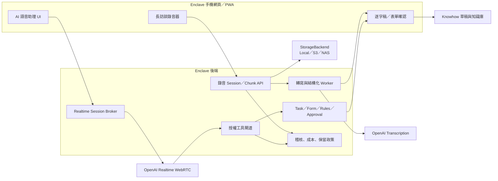

# Enclave 長時間語音訪談與 AI 語音助理開發計畫

**版本**：2.0  
**日期**：2026-08-13  
**狀態**：已依 production-ready 對外測試標準實作，待正式環境驗收  
**範圍**：手機網頁／PWA、OpenAI 語音服務、Enclave 現場作業與知識庫流程

---

## 1. 決策摘要

本計畫評估的兩項能力都可行，但應拆成兩條不同的產品與技術管線：

1. **「開始訪談」長時間錄音**：使用者直接在 Enclave 手機頁面錄製師傅訪談，不需第三方錄音 App，也不需自行製作逐字稿。系統負責分段保存、斷線續傳、非同步轉寫、說話者分離、結構化整理、人工校正與送審。
2. **AI 語音助理**：使用者與 AI 自然對話，由 AI 逐步詢問缺漏欄位、查詢授權範圍內的資料、建立報價單等文件草稿；所有寫入、送審與正式產出仍由 Enclave 後端驗證，並要求使用者明確確認。

兩者不能共用同一個錄音元件與處理流程：

- 長訪談重視「不遺失、可復原、完整逐字稿、說話者與時間軸」。
- 語音助理重視「低延遲、可插話、上下文、工具呼叫、逐欄確認」。

**執行順序**：先完成具備復原、重試、權限與保存政策的長訪談正式功能，再完成「建立報價單」AI 語音助理端到端流程，驗收後才擴充至其他現場作業。

---

## 2. OpenAI 技術可行性結論

### 2.1 長時間訪談

可行。OpenAI 的檔案轉寫適合「完成或有邊界的錄音」，一般轉寫建議使用 `gpt-transcribe`；需要區分訪談者與受訪者時，可使用 `gpt-4o-transcribe-diarize` 取得含 `speaker`、`start`、`end` 的段落。說話者標記目前屬於檔案轉寫能力，不適用於 Realtime 轉寫，因此長訪談應採「錄音可靠保存後，再非同步完成正式轉寫」的架構。

OpenAI 檔案轉寫的單檔上限為 25 MB。超過時必須壓縮或切成小於等於 25 MB 的段落，並避免在句子中間切斷。因此 Enclave 不能把一小時錄音只存在瀏覽器記憶體，應從錄音開始便持續產生小片段、落地並回報上傳狀態。

官方依據：

- [OpenAI File transcription：模型選擇、25 MB 上限與長音訊處理](https://developers.openai.com/api/docs/guides/speech-to-text)
- [OpenAI File transcription：Speaker diarization](https://developers.openai.com/api/docs/guides/speech-to-text#speaker-diarization)

### 2.2 AI 語音助理

可行。OpenAI 將語音代理分為：

- Speech-to-speech：自然、低延遲的即時對話。
- Chained pipeline：STT → 文字推理／工作流程 → TTS，適合既有文字代理與需要可預測控制的流程。

Enclave 的報價單、工單與審批屬於高結構、需驗證、不可未確認寫入的場景，因此採用**混合架構**：前端用 Realtime speech-to-speech 提供自然對話，後端仍由既有 TaskDefinition、TaskRun、表單 schema、權限與審批規則決定可以讀取與寫入什麼。

瀏覽器／手機端應以 WebRTC 連線。OpenAI 官方建議瀏覽器或行動裝置的即時語音使用 WebRTC；正式 API key 留在 Enclave 後端，由後端建立短效連線憑證或代理初始 SDP，不能放入前端。Realtime 模型支援 function calling，可讓語音代理要求後端執行「讀取欄位、更新草稿、驗證、預覽」等明確工具。

官方依據：

- [OpenAI Voice agents：speech-to-speech 與 chained pipeline 的取捨](https://developers.openai.com/api/docs/guides/voice-agents)
- [OpenAI Realtime API with WebRTC：瀏覽器／手機連線建議](https://developers.openai.com/api/docs/guides/realtime-webrtc)
- [OpenAI Realtime conversations：語音對話、狀態與 function calling](https://developers.openai.com/api/docs/guides/realtime-conversations)
- [OpenAI Semantic VAD：自然判斷使用者是否說完及允許插話](https://developers.openai.com/api/docs/guides/realtime-vad#semantic-vad)

### 2.3 明確限制

1. **手機網頁背景錄音**：頁面保持前景與螢幕亮起時可長時間錄音；切到其他 App、接電話、鎖屏或作業系統回收頁面後，瀏覽器可能暫停錄音。分段落地與續傳可避免已錄內容遺失，但不能保證網頁在鎖屏後持續錄製。若未來要求「鎖屏仍可連續錄製數小時」，需另評估原生 iOS／Android App。
2. **Realtime session 上限**：OpenAI Realtime 單一 session 最長 60 分鐘；產品應在 50–55 分鐘提示並平順切換新 session。長訪談不應依賴單一 Realtime session 保存正式錄音。
3. **單檔 25 MB**：長訪談必須使用受控壓縮、分段與非同步工作，不可直接沿用目前一次性上傳。
4. **工廠噪音與術語**：模型可透過 `gpt-transcribe` 的 prompt、keywords、languages 改善設備名、料號與縮寫，但必須用實際場域錄音做評估。`gpt-4o-transcribe-diarize` 不支援 prompt，需在轉寫後以租戶術語字典做校正候選。
5. **AI 不得直接完成高風險寫入**：function calling 只是提出工具呼叫，實際授權、欄位驗證、冪等與審批必須由 Enclave 後端執行。

---

## 3. 現有系統盤點與缺口

| 項目 | 現況 | 缺口／決策 |
|---|---|---|
| 短語音輸入 | `frontend/src/components/mka/PushToTalk.tsx`，上限 120 秒，停止後一次上傳 | 保留給短指令；不延長成訪談錄音器 |
| 後端語音限制 | `app/config.py` 的 `VOICE_MAX_AUDIO_SECONDS=120`、25 MB | 短語音 API 保持原限制；新增長錄音 session/chunk API |
| STT | `/api/v1/voice/transcribe` 與 `VoiceInteractionGateway` 已整合 OpenAI STT | 可重用 provider adapter，但需要非同步工作、分段、重試與 diarization |
| TTS | `/api/v1/voice/synthesize` 已存在 | 前端目前未形成完整語音回覆流程；作為 chained fallback 使用 |
| 知識訪談 UI | `frontend/src/pages/knowhow/InterviewPage.tsx` 目前要求貼上逐字稿 | 新增「開始訪談」、暫停、續錄、完成、處理進度與逐字稿校正 |
| 知識抽取 | `/api/v1/knowhow/interview/extract` 可由逐字稿建立草稿 | 改為正式 JSON schema 結構化抽取，保留人工校正與送審 |
| 音訊政策 | 已有 `save_audio`、`save_transcript`、保留天數設定 | 政策存在但目前沒有完整音檔物件儲存管線；必須補上 StorageBackend 與清除工作 |
| 現場任務 | 已有角色能力、TaskDefinition、TaskRun、表單、驗證、審批與 PDF | 適合作為 AI 語音助理的唯一寫入邊界 |
| 報價單 | 已有固定表單與語音轉欄位流程 | 作為 Realtime 語音助理第一個 production-ready 對外測試場景 |

結論：現有系統具備 STT、TTS、任務與審批基礎，但目前只能處理短語音，且語音主要是「轉文字後解析」，尚未具備長錄音可靠性或雙向 AI 語音代理。

---

## 4. 目標使用者流程

### 4.1 長訪談流程

1. 使用者進入「知識傳承／師傅訪談」。
2. 填寫主題、設備、受訪者、訪談者及資料權限。
3. 閱讀錄音與 AI 處理告知，勾選已取得受訪者同意。
4. 點「開始訪談」，畫面持續顯示錄音時間、音量、網路與已安全保存分鐘數。
5. 可暫停、繼續；斷網時片段先存在裝置，恢復連線後續傳。
6. 點「結束訪談」後，系統檢查所有片段已上傳並建立非同步轉寫工作。
7. 顯示處理進度；使用者可離開頁面，完成後由站內通知提醒。
8. 逐字稿顯示說話者與時間軸，允許播放原音、修正文字及標記重點。
9. AI 產生知識卡草稿：背景、前置條件、步驟、判斷訣竅、風險、禁止事項、適用設備。
10. 使用者校正後送審；只有核准版本才進入可檢索知識庫。

### 4.2 AI 語音助理建立報價單

1. 使用者在「開報價單」點「和 AI 對話建立」。
2. AI 先說明目前要建立的是草稿，並詢問客戶、品項、料號、數量、單價等資訊。
3. 使用者可自然說話、打斷、修正，例如「剛才數量不是兩百，是兩千」。
4. AI 透過後端工具查詢該角色可見的客戶、產品、價格或知識來源；無授權即拒絕並說明。
5. 畫面同步更新欄位、來源、信心與缺漏項目，不只播放聲音。
6. 重要欄位由 AI 讀回，使用者逐項或整批確認。
7. 後端執行 deterministic validation、計價與審批判斷。
8. 畫面顯示完整預覽。只有使用者按「確認建立／送審」或說出確認後再點畫面確認，後端才提交。
9. 系統回傳單號、草稿／待審狀態及下一步；重送相同確認不得產生重複單據。

---

## 5. 建議架構



### 5.1 架構原則

- **可靠錄音與正式轉寫分離**：先確保音訊安全保存，再做可重試的 AI 處理。
- **AI 只提議，系統決定**：AI 可辨識意圖、詢問與提出工具參數；權限、驗證、計算與狀態轉換由後端決定。
- **草稿先行**：語音助理只更新草稿，不得跳過預覽與確認直接送出。
- **全部可追溯**：逐字稿段落、AI 抽取欄位、工具呼叫、使用者修正與確認都保留 provenance/audit。
- **Provider 可替換**：模型名稱由設定與 feature flag 控制，不硬編碼在頁面或業務邏輯。
- **文字可完整替代**：拒絕麥克風權限、Realtime 中斷或嘈雜環境時，都能切回文字與固定表單。

---

## 6. Track A：長時間訪談開發規格

### 6.1 前端元件

新增 `LongInterviewRecorder`，不要修改 `PushToTalk` 的產品定位。

主要狀態：

- `requesting_permission`
- `ready`
- `recording`
- `paused`
- `offline_buffering`
- `uploading`
- `finalizing`
- `processing`
- `ready_for_review`
- `recoverable_error`
- `failed`

必要能力：

- `MediaRecorder` 以支援的 Opus/WebM 或 M4A 格式錄製。
- 每 30–60 秒或達設定大小產生 chunk，不等待錄音結束。
- 片段先寫入 IndexedDB，再上傳；後端 ACK 後依政策延後清除本地片段。
- 每個 chunk 包含 `session_id`、`sequence`、`started_at`、`duration_ms`、`mime_type`、`size`、`sha256`、`idempotency_key`。
- 顯示「已錄製」「已安全上傳」「尚待上傳」三種時間，不能只顯示錄音碼表。
- 頁面離開、重新整理或 PWA 重啟後，可恢復未完成 session 與上傳佇列。
- 有畫面鎖定／背景限制警告；支援時可使用 Screen Wake Lock，但不得宣稱保證背景錄音。
- 錄音開始前呈現同意告知，紀錄告知版本、同意者、時間與操作者。

### 6.2 後端與資料模型

新增或擴充：

```text
KnowledgeCaptureSession
  id, tenant_id, owner_id, title, interviewee, interviewer
  equipment_id, consent_version, consented_at
  state, recording_started_at, recording_ended_at
  total_duration_ms, expected_chunks, received_chunks
  audio_retention_policy_snapshot, transcript_policy_snapshot
  transcription_job_id, knowhow_card_id, error_code

AudioChunk
  id, session_id, sequence, storage_uri, mime_type
  size_bytes, sha256, duration_ms, started_at
  upload_state, transcription_state, created_at

TranscriptSegment
  id, session_id, sequence, speaker, start_ms, end_ms
  raw_text, corrected_text, confidence, source_chunk_id
  corrected_by, corrected_at
```

API 草案：

```text
POST   /api/v1/knowledge-captures
POST   /api/v1/knowledge-captures/{id}/chunks
GET    /api/v1/knowledge-captures/{id}/chunks
POST   /api/v1/knowledge-captures/{id}/complete
POST   /api/v1/knowledge-captures/{id}/abort
POST   /api/v1/knowledge-captures/{id}/retry
GET    /api/v1/knowledge-captures/{id}/status
GET    /api/v1/knowledge-captures/{id}/transcript
PATCH  /api/v1/knowledge-captures/{id}/transcript/segments/{segment_id}
POST   /api/v1/knowledge-captures/{id}/extract
```

規則：

- `(tenant_id, session_id, sequence)` 唯一；相同 idempotency key 或 hash 重傳只回傳原結果。
- MIME、大小、實際音訊長度與 checksum 全部驗證；拒絕偽造副檔名與超限片段。
- 音訊寫入既有 `StorageBackend` abstraction，key 必須以 tenant/session 隔離。
- `complete` 只封存錄音，不在同步 HTTP request 內等待整份轉寫。
- Worker 支援退避重試、dead-letter、手動 retry 與可觀測狀態。
- 刪除 session 時同步排程刪除音訊、逐字稿、衍生資料與索引；留下不含內容的稽核墓碑。

### 6.3 OpenAI 轉寫策略

| 場景 | 建議模型／模式 | 原因 |
|---|---|---|
| 單人經驗口述 | `gpt-transcribe` | 官方一般檔案轉寫首選，可帶 prompt、keywords、languages 改善術語 |
| 訪談者＋受訪者 | `gpt-4o-transcribe-diarize` + `diarized_json` + `chunking_strategy=auto` | 需要說話者、開始與結束時間 |
| 錄音進行中字幕 | Realtime transcription（選配） | 只做即時回饋，不作正式保存版本 |

處理步驟：

1. 驗證所有 chunk 與時間軸。
2. 依格式與大小合併或在靜音附近切段；OpenAI 請求檔案一律小於 25 MB。
3. 相鄰段保留短重疊區，合併時以時間與文字相似度去重。
4. 雙人訪談使用 diarization；若跨檔說話者 ID 不一致，以已知聲紋參考或人工映射統一。
5. 單人轉寫帶入租戶術語字典、設備名、料號格式與語言提示。
6. 保存 raw transcript；後續術語正規化只產生 corrected/candidate 版本，不覆蓋原文。
7. 結構化抽取使用 OpenAI Responses API 的 Structured Outputs，輸出符合 KnowhowCard JSON Schema；schema 驗證失敗或拒絕時進入人工處理。
8. 所有高風險內容（安全步驟、禁止事項、數值）要求人工確認後才能送審。

Structured Outputs 可讓模型輸出遵循指定 JSON Schema，適合把逐字稿轉成現有的 KnowhowCard 結構，但它不能取代內容正確性驗證與人工審閱。參考：[OpenAI Structured model outputs](https://developers.openai.com/api/docs/guides/structured-outputs)。

---

## 7. Track B：AI 語音助理開發規格

### 7.1 連線與 session

- 前端採 OpenAI Agents SDK for TypeScript 的 `RealtimeAgent`／`RealtimeSession` 或等價低階 WebRTC 實作。
- 初始 session 由 `POST /api/v1/voice/realtime/session` 建立；後端驗證 Enclave 登入、tenant、role、capability、速率與額度後，才簽發短效憑證或完成 unified WebRTC 握手。
- OpenAI standard API key 永不下發至前端，也不寫入 log、analytics 或 error response。
- session instruction 由後端組裝，包含角色、租戶、目前任務、允許工具、禁止行為與語言；前端不得自行擴大工具清單。
- 使用 `semantic_vad` 減少中文思考停頓時被打斷，並允許使用者插話中止 AI 回覆；須用實際場域語音完成驗收。
- 50–55 分鐘時建立新 session 並移交由 Enclave 保存的任務摘要，不依賴 OpenAI session 作永久記憶。

### 7.2 後端工具白名單

第一期只提供以下工具；每個工具都需重新檢查 AuthorizationContext：

```text
get_current_task_context()
get_current_draft()
list_missing_fields()
search_authorized_customer(query)
search_authorized_product(query)
search_authorized_knowledge(query, scope)
patch_draft_fields(fields, source_turn_id)
validate_draft()
calculate_quote()
prepare_confirmation()
submit_with_confirmation(confirmation_token)
cancel_draft()
```

工具安全規則：

- 搜尋只回傳使用者原本可見資料，不能因 AI 而擴權。
- `patch_draft_fields` 只能寫草稿，且欄位必須存在於目前表單 schema。
- 模型輸入中的客戶文字、知識內容與工具結果均視為不可信資料，不得覆蓋 system policy 或工具權限。
- `prepare_confirmation` 由後端建立不可竄改、短效、綁定 draft version 的 confirmation token。
- `submit_with_confirmation` 必須同時滿足：token 有效、版本未變、權限有效、validation 通過、使用者已於 UI 明確確認。
- 所有 mutation 帶 idempotency key；重複語音或網路重試不得產生重複單據。
- 每次 tool call 保存工具名、參數摘要、結果摘要、延遲、authz decision、draft version 與 actor；敏感欄位按政策遮罩。

### 7.3 對話狀態機

```text
idle
  -> listening
  -> collecting_fields
  -> resolving_ambiguity
  -> confirming_critical_fields
  -> validating
  -> preview_ready
  -> awaiting_explicit_confirmation
  -> submitting
  -> completed

任何階段皆可 -> paused / text_fallback / cancelled / recoverable_error
```

模型不得跳過狀態。後端是狀態真相來源；AI 說「已建立」不等於完成，必須收到後端成功 receipt 與單號才能向使用者宣告完成。

### 7.4 UIUX 要求

- AI 說話時同步顯示字幕與「停止」按鈕。
- 畫面永久顯示目前建立的文件類型與狀態（草稿／待確認／送審中／完成）。
- 欄位即時顯示值與來源，使用者可點欄位直接更正。
- 不確定資料使用明確問句，不以低信心值偷偷填入。
- 關鍵欄位（客戶、幣別、品項、數量、單價、稅、總額、有效日期）有視覺強調與確認狀態。
- AI 回覆控制在短句；需要長篇解釋時改用畫面文字。
- 斷線後保留 Enclave 草稿，提供「恢復對話」；不要求重講全部內容。
- 提供麥克風拒絕、音訊裝置切換、回音、過度噪音、Realtime 不可用與額度不足的可恢復畫面。
- 每個語音操作都有等價的文字與觸控操作，符合 WCAG 2.2 AA 目標。

### 7.5 模型與成本策略

- Pilot 先以 OpenAI 官方文件目前示例的 `gpt-realtime-2.1` 建立品質基線；模型名稱以設定檔與 feature flag 管理。
- 品質達標後再評估較小的 Realtime 模型，不先用較便宜模型犧牲工具呼叫與指令遵循。
- 監控 `response.done` usage。官方說明使用者音訊約每 100 ms 為一個 audio token，助理音訊約每 50 ms 一個 audio token；應限制冗長回覆、長 session 上下文與無意義的自動 response。
- 對長對話做伺服器端摘要並換 session，不把完整歷史無限累積。
- 設 tenant／user 每日分鐘數、並發 session、單次 session 與月費預警；UI 在達限制前提示。

參考：[OpenAI Managing Realtime costs](https://developers.openai.com/api/docs/guides/realtime-costs)。實際價格會變動，開發前與上線前均需以當時官方 pricing 重新估算，不在程式碼中寫死價格。

---

## 8. 安全、隱私與治理

### 8.1 使用者與租戶資料

- 錄音前明確告知「正在錄音」「用途」「保存項目」「保存多久」「會送往哪一類 AI 服務」。
- 音訊保存預設沿用 tenant policy；但產品需區分「不保存原音」「保存至審核完成」「保存 N 天」。
- 音訊、逐字稿、AI 工具輸入與輸出都綁定 tenant，通過既有 RBAC／capability；物件儲存 key、簽名 URL 與 worker 讀取均需 tenant 驗證。
- 傳輸使用 TLS；物件儲存與資料庫靜態加密；API key 使用 secrets manager／部署 secret，不進資料庫與前端 bundle。
- 提供管理員刪除、匯出、保留政策與清除結果稽核。
- 禁止在一般 application log 寫入完整逐字稿、原音或敏感表單值。

### 8.2 OpenAI 資料控制

OpenAI 官方說明：API 資料預設不會用於訓練模型，除非客戶明確 opt in；預設 abuse monitoring 可能保留客戶內容最多 30 天，符合資格並經核准的客戶可申請 Modified Abuse Monitoring 或 Zero Data Retention。文件目前也列出 `/v1/audio/transcriptions` 沒有 abuse monitoring/application-state retention，`/v1/realtime` 預設有 30 天 abuse monitoring 且沒有 application-state retention；實際簽約、區域與組織設定仍需上線前由管理者核對。

參考：[OpenAI Data controls in the OpenAI platform](https://developers.openai.com/api/docs/guides/your-data)。

上線 gate：

- 確認 OpenAI project 的資料控制設定、地區需求與合約條款。
- 確認客戶是否允許音訊離開其網路邊界；不允許時此功能必須停用或切換核准的地端 provider。
- 把 provider、model、endpoint 類別、資料處理地區與 retention snapshot 寫入每次 capture/session 的稽核 metadata。

---

## 9. 分期開發計畫

以下為工程人日估算，不含採購／法務等待；以 1 名全端、1 名後端／AI、兼任 QA／UX 計，約 **8–12 個日曆週**。實際排程在 Phase 0 測試後校正。

### Phase 0：技術 spike 與設計凍結（3–5 人日）

工作：

- 以 iOS Safari／PWA、Android Chrome、桌面 Chrome 驗證 MediaRecorder 格式、長錄音、IndexedDB、斷網與恢復。
- 用 10、30、60 分鐘真實中文工廠錄音比較 `gpt-transcribe` 與 diarization 品質、延遲與成本。
- 建立 Realtime WebRTC proof-of-concept：中文對話、插話、session broker、一次唯讀工具呼叫。
- 確認 StorageBackend、音訊保留政策與 OpenAI project 資料控制。

出口條件：

- 支援裝置矩陣、錄音格式、chunk 大小、模型設定與資料政策決策有書面記錄。
- 30 分鐘錄音在斷網後可完整恢復，片段 hash 全數一致。
- Realtime API key 未出現在 browser network response、source map 或 log。

### Phase 1：可靠錄音與儲存基礎（7–10 人日）

工作：

- 建立 capture session、audio chunk migration、API 與 StorageBackend 寫入。
- 實作 LongInterviewRecorder、IndexedDB queue、ACK、重試、恢復、pause/resume。
- 實作 consent snapshot、retention snapshot、quota、清除 worker 與 audit。
- 加入 feature flag：`long_interview_recording`。

出口條件：

- 60 分鐘測試錄音不會因前端記憶體累積而失敗。
- 網路中斷、重整、重複上傳均不遺失、不重複片段。
- 未同意、無權限、超額、錯誤 MIME 或跨 tenant 請求全部 fail closed。

### Phase 2：轉寫、說話者與知識草稿（8–12 人日）

工作：

- 實作非同步 transcription job、OpenAI adapter 模式、分段／合併／重試。
- 實作 transcript segments、說話者命名、時間軸播放與人工校正。
- 以 Structured Outputs 產生 KnowhowCard 草稿，接既有送審與 draft isolation。
- 加入處理進度與完成通知。

出口條件：

- 30／60 分鐘錄音皆可完成逐字稿；Worker 重啟後工作可續跑。
- 說話者、段落時間可回放到相對應音訊。
- AI 產物只建立草稿，未核准內容不可進正式知識檢索。

### Phase 3：AI 語音助理平台（8–12 人日）

工作：

- 建立 Realtime session broker、WebRTC UI、semantic VAD、插話與字幕。
- 建立 server-side tool gateway、tool schema registry、turn/tool audit、cost usage。
- 將 Enclave TaskRun 作為對話狀態真相，完成恢復與文字 fallback。
- 加入後端設定 `VOICE_REALTIME_ENABLED`，只有具報價任務權限的角色可建立 session；對外測試環境由發佈流程明確啟用。

出口條件：

- 可連續 20 回合中文交談、插話與修正，UI 與後端草稿狀態一致。
- 未授權工具與資料無法由 prompt injection 或前端竄改取得。
- Realtime 中斷後可用文字接續同一 TaskRun。

### Phase 4：報價單端到端對外測試版（8–12 人日）

工作：

- 實作報價單工具、欄位追問、候選消歧、計價、預覽、confirmation token 與送審。
- 加入 critical-field readback、欄位來源、低信心處理與重複提交防護。
- 以業務、現場、師傅、管理員與唯讀角色做瀏覽器 UAT。

出口條件：

- 使用者可只靠對話加最後確認完成合法報價草稿／送審。
- 所有關鍵欄位在提交前均有畫面值與確認紀錄。
- 0 件未確認正式寫入；重複確認只產生 1 件結果。

### Phase 5：硬化與擴充（8–12 人日）

工作：

- 加入場域噪音、藍牙耳機、權限拒絕、長 session 切換、成本與 rate-limit 測試。
- 擴充交接、事故、日報等低至中風險任務；每個任務獨立通過 eval 後開啟。
- 建立營運 dashboard、runbook、模型切換與 rollback。

出口條件：

- Pilot 指標達門檻，安全／隱私／成本／SLO gate 全數簽核。
- 每個新增任務有 golden conversations、權限矩陣與失敗案例。

---

## 10. 驗收與評估矩陣

### 10.1 長訪談

| 類別 | 必測案例 | 驗收門檻 |
|---|---|---|
| 完整性 | 10／30／60 分鐘、暫停續錄、前景長錄 | 後端片段總時長與錄音誤差小於 1%，0 遺失片段 |
| 弱網 | 離線 10 分鐘、網路切換、逾時、重複 ACK | 可自動／手動續傳；0 重複、0 靜默遺失 |
| 恢復 | 重整頁面、PWA 被關閉後重開、後端 worker 重啟 | 未完成 session 可辨識並恢復 |
| 音訊 | 安靜、機台噪音、口罩、遠距、藍牙耳機 | 依 golden set 記錄 CER／關鍵實體正確率，不以主觀「聽起來可以」驗收 |
| 術語 | 料號、設備名、中英混說、數值單位 | 關鍵實體經人工確認後正確率 100%；未確認不得發佈 |
| 說話者 | 2 人交替、重疊說話、跨 chunk | 能回放與人工更名；不確定時顯示未知而非猜測身份 |
| 隱私 | 未同意、撤回、到期清除、跨 tenant | 全部 fail closed；清除有可驗證稽核結果 |

### 10.2 AI 語音助理

| 類別 | 必測案例 | 驗收門檻 |
|---|---|---|
| 對話 | 停頓、插話、改口、一次提供多欄、答非所問 | 能回到正確缺漏問題，既有已確認欄位不被意外覆蓋 |
| 欄位 | 客戶同名、料號相近、數量／單價修正、幣別 | 模糊時必須消歧；關鍵欄位提交前 100% 有確認紀錄 |
| 工具 | 查詢、計算、驗證、寫草稿、提交 | schema 驗證 100%；未列入白名單的工具不可執行 |
| 權限 | 六種既有角色、跨部門、跨 tenant、唯讀 | 結果與目前瀏覽器／API 權限一致，AI 不擴權 |
| 安全 | Prompt injection、知識文件誘導、偽造 confirmation token | 0 未授權資料外洩，0 未確認正式寫入 |
| 冪等 | 連點、重說確認、斷線重送、逾時後重試 | 同一意圖只建立 1 件 TaskRun／單據 |
| 降級 | OpenAI 斷線、麥克風拒絕、額度不足、TTS 失敗 | 草稿不遺失，可切文字／固定表單完成 |
| 效能 | 4G／Wi-Fi、多回合、20 回合 | 記錄首音延遲、工具延遲與完成時間；Phase 0 設定正式 SLO |

### 10.3 建議產品指標

- 訪談錄音完成率、可恢復失敗率、每小時上傳失敗率。
- 逐字稿校正字元比例、關鍵術語／數值人工修正率。
- 從錄音結束到逐字稿可審時間。
- 語音助理任務完成率、平均追問回合、使用者中途切文字比例。
- 關鍵欄位修正率、未確認寫入事件（目標必須為 0）。
- 每完成一份訪談／報價的 OpenAI 成本、p50／p95 延遲。
- 角色／裝置／瀏覽器別成功率，避免總平均掩蓋特定裝置故障。

---

## 11. 上線與回滾

- 所有新能力以 tenant、role、task 三層 feature flag 控制。
- 先完成自動測試與正式站受控帳號驗收，再開放已獲授權的對外測試角色；不得繞過角色與任務權限。
- 長訪談與 Realtime 助理可獨立關閉；關閉後既有 PushToTalk、文字與固定表單仍可使用。
- 模型、provider、VAD 與 session 上限採 server config，可無前端重新部署切換。
- 發生資料完整性、越權、未確認寫入或無法清除音訊時立即 kill switch。
- 回滾不得刪除已建立草稿；未完成 capture session 保持可匯出／清除狀態。

---

## 12. 開發前必須確認的產品決策

1. 長訪談第一版承諾最長時間：建議 **60 分鐘**，而非宣稱無上限。
2. 第一版支援條件：建議明確要求錄音期間頁面保持前景與螢幕開啟。
3. 原音保存預設：建議 tenant 可選，預設「保存至審核完成後 N 天」或沿用目前預設不長期保存原音。
4. 第一個對外測試組合：雙人師傅訪談＋業務建立報價單。
5. OpenAI 雲端處理是否符合目標客戶資料政策；若不符合，功能需停用或另開地端 provider 專案。
6. Pilot 裝置矩陣：至少 iPhone Safari、Android Chrome、桌面 Chrome；若客戶指定企業管控瀏覽器需另列。

這些決策不阻礙開始 Phase 0，但必須在 Phase 1 migration 與 UI 定稿前凍結。

---

## 13. 完成定義（Definition of Done）

只有同時符合以下條件才可稱為「完成」：

- 使用者能在 Enclave 手機頁面開始、暫停、續錄與結束訪談，不需第三方 App 或自行轉寫。
- 30／60 分鐘錄音通過實機弱網、恢復、完整性與保留政策測試。
- 逐字稿、說話者、時間軸、人工校正、知識草稿與送審完整走到底。
- 使用者能與 AI 對話完成報價草稿、欄位修正、資料查詢、驗證、預覽、明確確認及送審。
- AI 無法越權、無法跳過確認、無法重複建立單據；所有 tool call 可稽核。
- 麥克風／Realtime／OpenAI 失敗時，文字與固定表單流程仍能完成任務。
- 六種既有角色依權限完成瀏覽器端端到端驗收，不只做 API 或單元測試。
- OpenAI 資料控制、客戶同意、音訊保留／刪除、成本額度與營運 runbook 均已驗證。
- 新功能經 feature flag 小流量啟用，觀察期達標後才逐步放量。

---

## 14. 建議的第一個實作切片

第一個可交付切片應是：

> **iPhone／Android 在知識訪談頁錄製 30 分鐘 → 分段可靠上傳 → OpenAI 產生含說話者的逐字稿 → 使用者校正 → 產生 KnowhowCard 草稿 → 送審。**

這個切片先驗證最難的資料完整性、行動裝置與知識生命週期。完成後，再以相同的安全、權限、稽核基礎交付：

> **Realtime AI 逐欄詢問 → 建立報價草稿 → 計算與預覽 → 使用者明確確認 → 送審。**

兩個切片都通過本文驗收矩陣後，才擴展至其他角色與現場作業。
